##1. Set-up

Load all the required libraries.


```r
library(tidyverse)
library(sf)
library(ggthemes)
library(viridis)
library(scales)
library(lubridate)
library(brms)
library(arsenal)
library(knitr)
library(here)
library(spdep)
library(broom)
library(RANN)
library(forcats)
library(cowplot)
library(bayesplot)
```

<br>

##2. Reproducibility

This analysis was run on *2018-06-13 13:44:18*, using the following system profile and package versions:


```r
sessionInfo()
```

```
R version 3.5.0 (2018-04-23)
Platform: x86_64-apple-darwin15.6.0 (64-bit)
Running under: macOS High Sierra 10.13.3

Matrix products: default
BLAS: /Library/Frameworks/R.framework/Versions/3.5/Resources/lib/libRblas.0.dylib
LAPACK: /Library/Frameworks/R.framework/Versions/3.5/Resources/lib/libRlapack.dylib

locale:
[1] en_GB.UTF-8/en_GB.UTF-8/en_GB.UTF-8/C/en_GB.UTF-8/en_GB.UTF-8

attached base packages:
[1] stats     graphics  grDevices utils     datasets  methods   base     

other attached packages:
 [1] bayesplot_1.5.0    cowplot_0.9.2      RANN_2.5.1        
 [4] broom_0.4.4        spdep_0.7-7        spData_0.2.8.3    
 [7] Matrix_1.2-14      sp_1.2-7           here_0.1          
[10] knitr_1.20         arsenal_1.2.0      brms_2.3.1        
[13] Rcpp_0.12.17       lubridate_1.7.4    scales_0.5.0      
[16] viridis_0.5.1      viridisLite_0.3.0  ggthemes_3.5.0    
[19] sf_0.6-1           forcats_0.3.0      stringr_1.3.1     
[22] dplyr_0.7.5        purrr_0.2.5        readr_1.1.1       
[25] tidyr_0.8.1        tibble_1.4.2       ggplot2_2.2.1.9000
[28] tidyverse_1.2.1   

loaded via a namespace (and not attached):
 [1] colorspace_1.3-2     deldir_0.1-15        class_7.3-14        
 [4] ggridges_0.5.0       rsconnect_0.8.8      rprojroot_1.3-2     
 [7] markdown_0.8         base64enc_0.1-3      rstudioapi_0.7      
[10] rstan_2.17.3         DT_0.4               mvtnorm_1.0-8       
[13] xml2_1.2.0           splines_3.5.0        bridgesampling_0.4-0
[16] mnormt_1.5-5         shinythemes_1.1.1    jsonlite_1.5        
[19] shiny_1.1.0          compiler_3.5.0       httr_1.3.1          
[22] backports_1.1.2      assertthat_0.2.0     lazyeval_0.2.1      
[25] cli_1.0.0            later_0.7.2          htmltools_0.3.6     
[28] tools_3.5.0          bindrcpp_0.2.2       igraph_1.2.1        
[31] coda_0.19-1          gtable_0.2.0         glue_1.2.0.9000     
[34] reshape2_1.4.3       gmodels_2.16.2       cellranger_1.1.0    
[37] gdata_2.18.0         nlme_3.1-137         udunits2_0.13       
[40] crosstalk_1.0.0      psych_1.8.4          testthat_2.0.0      
[43] rvest_0.3.2          mime_0.5             miniUI_0.1.1        
[46] gtools_3.5.0         LearnBayes_2.15.1    MASS_7.3-49         
[49] zoo_1.8-1            colourpicker_1.0     hms_0.4.2           
[52] promises_1.0.1       Brobdingnag_1.2-5    parallel_3.5.0      
[55] expm_0.999-2         inline_0.3.14        shinystan_2.5.0     
[58] yaml_2.1.19          gridExtra_2.3        loo_2.0.0           
[61] StanHeaders_2.17.2   stringi_1.2.2        dygraphs_1.1.1.4    
[64] e1071_1.6-8          boot_1.3-20          rlang_0.2.1         
[67] pkgconfig_2.0.1      matrixStats_0.53.1   evaluate_0.10.1     
[70] lattice_0.20-35      bindr_0.1.1          rstantools_1.5.0    
[73] htmlwidgets_1.2      tidyselect_0.2.4     plyr_1.8.4          
[76] magrittr_1.5         R6_2.2.2             DBI_0.8             
[79] pillar_1.2.3         haven_1.1.1          foreign_0.8-70      
[82] withr_2.1.2          units_0.5-1          xts_0.10-2          
[85] abind_1.4-5          modelr_0.1.2         crayon_1.3.4        
[88] rmarkdown_1.9        grid_3.5.0           readxl_1.1.0        
[91] threejs_0.3.1        digest_0.6.15        classInt_0.2-3      
[94] xtable_1.8-2         httpuv_1.4.3         stats4_3.5.0        
[97] munsell_0.4.3        shinyjs_1.0         
```

<br>

##3. Map theme

Create a base theme function for the maps.


```r
map_light <- function(...) {
  theme_minimal() +
  theme(
    text = element_text(family = "Helvetica", color = "#22211d"),
    axis.line = element_blank(),
    axis.text.x = element_blank(),
    axis.text.y = element_blank(),
    axis.ticks = element_blank(),
    axis.title.x = element_blank(),
    axis.title.y = element_blank(),
    panel.grid.major = element_line(color = "#ebebe5", size = 0.2),
    panel.grid.minor = element_blank(),
    plot.background = element_rect(fill = "white", color = NA), 
    panel.background = element_rect(fill = "white", color = NA), 
    legend.background = element_rect(fill = "white", color = NA),
    panel.border = element_blank(),
    ...
  )
}
```

<br>

##4. Figure 1: Total population

Describe summary characteristics of the population.


```r
data("dat", package="BlantyreTBEpi")

dat %>%
  st_set_geometry(., NULL) %>%
  summarise(total=sum(total))
```

```
##    total
## 1 753489
```

```r
dat %>%
  st_set_geometry(., NULL) %>%
  summarise(min=min(total))
```

```
##   min
## 1 162
```

```r
dat %>%
  st_set_geometry(., NULL) %>%
  summarise(min=max(total))
```

```
##     min
## 1 13066
```

```r
dat %>%
  st_set_geometry(., NULL) %>%
  summarise(mean=mean(total),
            sd= sd(total))
```

```
##       mean       sd
## 1 2392.029 1510.424
```

```r
dat %>%
  st_set_geometry(., NULL) %>%
  summarise(median=median(total),
            i25=quantile(total, probs = 0.25),
            i75=quantile(total, probs = 0.75))
```

```
##   median    i25  i75
## 1   2043 1337.5 3035
```

```r
dat %>%
  st_set_geometry(., NULL) %>%
  summarise(min_m_f_adult_ratio = min(m_f_adult_ratio),
            mean_m_f_adult_ratio = mean(m_f_adult_ratio),
            max_m_f_adult_ratio = max(m_f_adult_ratio))
```

```
##   min_m_f_adult_ratio mean_m_f_adult_ratio max_m_f_adult_ratio
## 1            0.826087             1.044611            1.345912
```

```r
dat %>%
  st_set_geometry(., NULL) %>%
  summarise(min_prop_adults = min(prop_adults),
            mean_prop_adults = mean(prop_adults),
            max_prop_adults = max(prop_adults))
```

```
##   min_prop_adults mean_prop_adults max_prop_adults
## 1        44.42997         61.52605        77.97764
```

```r
dat %>%
  st_set_geometry(., NULL) %>%
  summarise(min_pov = min(mwi11povcons200),
            mean_pov = mean(mwi11povcons200),
            max_pov = max(mwi11povcons200))
```

```
##    min_pov mean_pov  max_pov
## 1 13.29293 32.74659 78.60181
```


Plot the total population of Blantyre.


```r
data("dat", package="BlantyreTBEpi")
data("clinics", package="BlantyreTBEpi")

g1<- ggplot() +
  geom_sf(data = dat, aes(fill = total)) +
  geom_sf(data=clinics, shape=17, colour="#22211d") +
  map_light() +
  scale_fill_viridis(option = "magma", direction = -1,
                     name ="Count",
                     labels=comma) +
  labs(x = NULL, 
       y = NULL) +
  theme(legend.text.align = 1)

g1
```

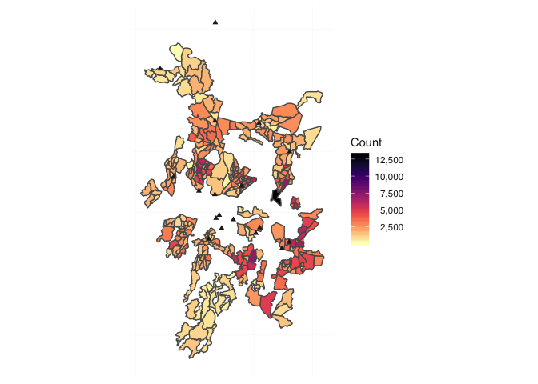<!-- -->

```r
ggsave(file="Figure1.pdf", width=6, height=6, dpi=300, 
       path = here("figures"))
```

<br>

##5. Population density

Plot the population density of Blantyre.


```r
g2 <- ggplot() +
  geom_sf(data = dat, aes(fill = popdens)) +
  geom_sf(data=clinics, shape=17, colour="#22211d") +
  map_light() +
  scale_fill_viridis(option = "magma", direction = -1,
                     name = expression ("Population\nper\nsquare km"),
                     labels=comma) +
  labs(x = NULL, 
       y = NULL) +
  theme(legend.text.align = 1)

g2
```

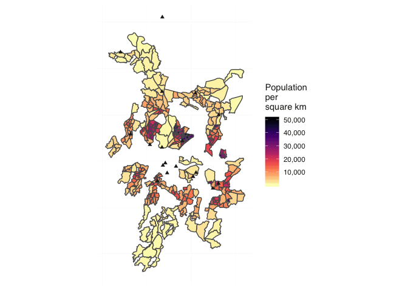<!-- -->

```r
ggsave(file="popdensity.pdf", width=6, height=6, dpi=300, 
       path = here("figures"))
```

<br>

##6. People per household

Plot the mean people per household Blantyre.


```r
g3 <- ggplot() +
  geom_sf(data = dat, aes(fill = mean_people_per_hh)) +
  geom_sf(data=clinics, shape=17, colour="#22211d") +
  map_light() +
  scale_fill_viridis(option = "magma", direction = -1,
                     name = expression ("Mean number\nof people\nper household"),
                     labels=comma) +
  labs(x = NULL, 
       y = NULL) +
  theme(legend.text.align = 1)

g3
```

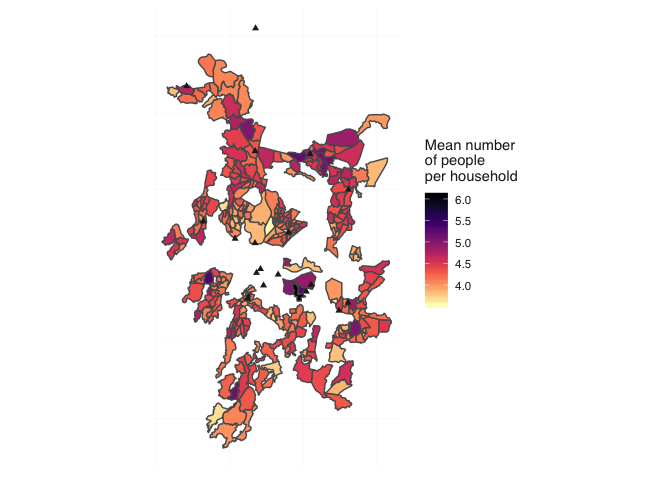<!-- -->

```r
ggsave(file="mean_hh_people.pdf", width=6, height=6, dpi=300, 
       path = here("figures"))
```

<br>

##7. Poverty distribution

Plot the estimaed mean proportion of the population living on less than $2 per day. [Note this is estimated from Worldpop data]


```r
g4 <- ggplot() +
  geom_sf(data = dat, aes(fill = mwi11povcons200)) +
  geom_sf(data=clinics, shape=17, colour="#22211d") +
  map_light() +
  scale_fill_viridis(option = "magma", direction = -1,
                     name = expression ("Mean percentage\nof people\nliving on\nless than\nUS $2 per day"),
                     labels=comma,
                     limits = c(0,100)) +
  labs(x = NULL, 
       y = NULL) +
  theme(legend.text.align = 1)

g4
```

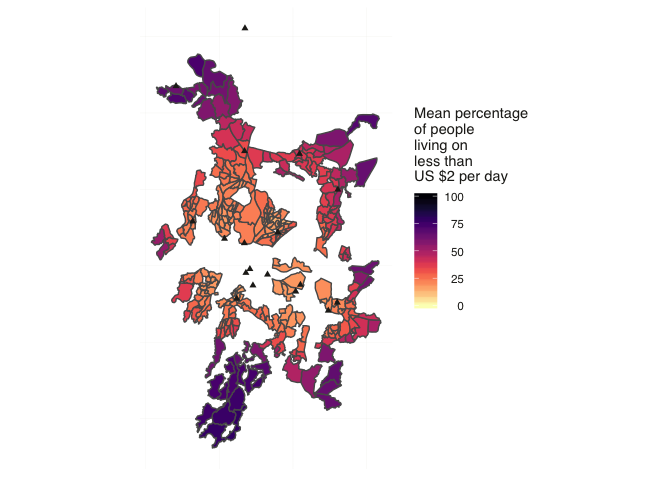<!-- -->

```r
ggsave(file="poverty.pdf", width=6, height=6, dpi=300, 
       path = here("figures"))
```

<br>

##8. Distance to nearest TB registration site


```r
data("dat", package="BlantyreTBEpi")

g5 <- ggplot() +
  geom_sf(data = dat, aes(fill = clinic_distance)) +
  geom_sf(data=clinics, shape=17, colour="#22211d") +
  map_light() +
  scale_fill_viridis(option = "magma", direction = -1,
                     name = expression ("Distance (m)\nto nearest\nTB registration\ncentre"),
                     labels=comma,
                     limits = c(0,10000)) +
  labs(x = NULL, 
       y = NULL) +
  theme(legend.text.align = 1)

g5
```

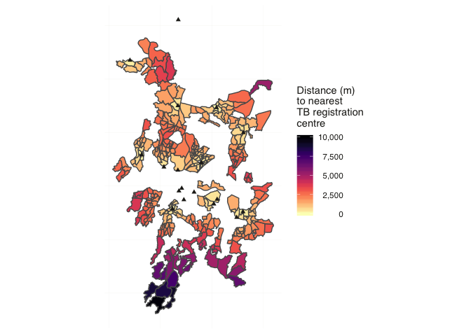<!-- -->

```r
ggsave(file="distance_to_clinic.pdf", width=6, height=6, dpi=300, 
       path = here("figures"))
```


<br>

##9. Male to female adult ratio


```r
g6 <- ggplot() +
  geom_sf(data = dat, aes(fill = m_f_adult_ratio)) +
  geom_sf(data=clinics, shape=17, colour="#22211d") +
  map_light() +
  scale_fill_viridis(option = "magma", direction = -1,
                     name = expression ("Adult\nMale:Female\nratio"),
                     labels=comma) +
  labs(x = NULL, 
       y = NULL) +
  theme(legend.text.align = 1)

g6
```

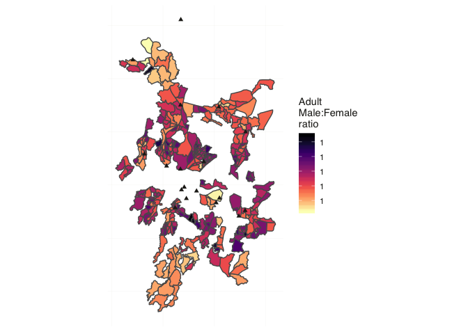<!-- -->

```r
ggsave(file="m_f_ratio.pdf", width=6, height=6, dpi=300, 
       path = here("figures"))
```

<br>

##10. Percentage of HSA cluster population who is adult


```r
g7 <- ggplot() +
  geom_sf(data = dat, aes(fill = prop_adults)) +
  geom_sf(data=clinics, shape=17, colour="#22211d") +
  map_light() +
  scale_fill_viridis(option = "magma", direction = -1,
                     name = expression ("Percent\naged\n15 years\nor older"),
                     labels=comma) +
  labs(x = NULL, 
       y = NULL) +
  theme(legend.text.align = 1)

g7
```

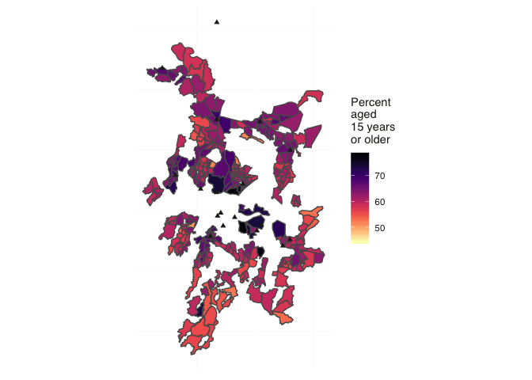<!-- -->

```r
ggsave(file="prop_adults.pdf", width=6, height=6, dpi=300, 
       path = here("figures"))
```

<br>

##11. Sputum smear positive to negative ratio.


```r
#Add in a term for ratio of smearpositive to smearnegative cases

dat <- dat %>%
  mutate(smr_ratio = n_smearpos_cases/(n_cases-n_smearpos_cases))

dat$smr_ratio[is.nan(dat$smr_ratio)] <- 1
dat$smr_ratio[is.infinite(dat$smr_ratio)] <- 1


g8 <- ggplot() +
  geom_sf(data = dat, aes(fill = smr_ratio)) +
  geom_sf(data=clinics, shape=17, colour="#22211d") +
  map_light() +
  scale_fill_viridis(option = "magma", direction = -1,
                     name = expression ("Smr +ve:-ve\nratio"),
                     labels=comma) +
  labs(x = NULL, 
       y = NULL) +
  theme(legend.text.align = 1)

g8
```

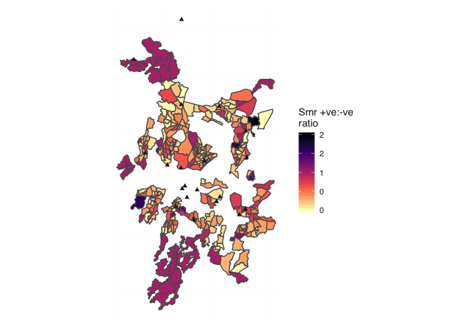<!-- -->

```r
ggsave(file="smr_pos_neg.pdf", width=6, height=6, dpi=300, 
       path = here("figures"))
```

```
## Warning in grid.Call(C_textBounds, as.graphicsAnnot(x$label), x$x, x$y, :
## font metrics unknown for character 0xa

## Warning in grid.Call(C_textBounds, as.graphicsAnnot(x$label), x$x, x$y, :
## font metrics unknown for character 0xa

## Warning in grid.Call(C_textBounds, as.graphicsAnnot(x$label), x$x, x$y, :
## font metrics unknown for character 0xa

## Warning in grid.Call(C_textBounds, as.graphicsAnnot(x$label), x$x, x$y, :
## font metrics unknown for character 0xa

## Warning in grid.Call(C_textBounds, as.graphicsAnnot(x$label), x$x, x$y, :
## font metrics unknown for character 0xa

## Warning in grid.Call(C_textBounds, as.graphicsAnnot(x$label), x$x, x$y, :
## font metrics unknown for character 0xa

## Warning in grid.Call(C_textBounds, as.graphicsAnnot(x$label), x$x, x$y, :
## font metrics unknown for character 0xa

## Warning in grid.Call(C_textBounds, as.graphicsAnnot(x$label), x$x, x$y, :
## font metrics unknown for character 0xa

## Warning in grid.Call(C_textBounds, as.graphicsAnnot(x$label), x$x, x$y, :
## font metrics unknown for character 0xa

## Warning in grid.Call(C_textBounds, as.graphicsAnnot(x$label), x$x, x$y, :
## font metrics unknown for character 0xa

## Warning in grid.Call(C_textBounds, as.graphicsAnnot(x$label), x$x, x$y, :
## font metrics unknown for character 0xa

## Warning in grid.Call(C_textBounds, as.graphicsAnnot(x$label), x$x, x$y, :
## font metrics unknown for character 0xa

## Warning in grid.Call(C_textBounds, as.graphicsAnnot(x$label), x$x, x$y, :
## font metrics unknown for character 0xa

## Warning in grid.Call(C_textBounds, as.graphicsAnnot(x$label), x$x, x$y, :
## font metrics unknown for character 0xa

## Warning in grid.Call(C_textBounds, as.graphicsAnnot(x$label), x$x, x$y, :
## font metrics unknown for character 0xa

## Warning in grid.Call(C_textBounds, as.graphicsAnnot(x$label), x$x, x$y, :
## font metrics unknown for character 0xa

## Warning in grid.Call(C_textBounds, as.graphicsAnnot(x$label), x$x, x$y, :
## font metrics unknown for character 0xa

## Warning in grid.Call(C_textBounds, as.graphicsAnnot(x$label), x$x, x$y, :
## font metrics unknown for character 0xa

## Warning in grid.Call(C_textBounds, as.graphicsAnnot(x$label), x$x, x$y, :
## font metrics unknown for character 0xa

## Warning in grid.Call(C_textBounds, as.graphicsAnnot(x$label), x$x, x$y, :
## font metrics unknown for character 0xa

## Warning in grid.Call(C_textBounds, as.graphicsAnnot(x$label), x$x, x$y, :
## font metrics unknown for character 0xa

## Warning in grid.Call(C_textBounds, as.graphicsAnnot(x$label), x$x, x$y, :
## font metrics unknown for character 0xa

## Warning in grid.Call(C_textBounds, as.graphicsAnnot(x$label), x$x, x$y, :
## font metrics unknown for character 0xa

## Warning in grid.Call(C_textBounds, as.graphicsAnnot(x$label), x$x, x$y, :
## font metrics unknown for character 0xa

## Warning in grid.Call(C_textBounds, as.graphicsAnnot(x$label), x$x, x$y, :
## font metrics unknown for character 0xa

## Warning in grid.Call(C_textBounds, as.graphicsAnnot(x$label), x$x, x$y, :
## font metrics unknown for character 0xa

## Warning in grid.Call(C_textBounds, as.graphicsAnnot(x$label), x$x, x$y, :
## font metrics unknown for character 0xa

## Warning in grid.Call(C_textBounds, as.graphicsAnnot(x$label), x$x, x$y, :
## font metrics unknown for character 0xa

## Warning in grid.Call(C_textBounds, as.graphicsAnnot(x$label), x$x, x$y, :
## font metrics unknown for character 0xa

## Warning in grid.Call(C_textBounds, as.graphicsAnnot(x$label), x$x, x$y, :
## font metrics unknown for character 0xa

## Warning in grid.Call(C_textBounds, as.graphicsAnnot(x$label), x$x, x$y, :
## font metrics unknown for character 0xa

## Warning in grid.Call(C_textBounds, as.graphicsAnnot(x$label), x$x, x$y, :
## font metrics unknown for character 0xa

## Warning in grid.Call(C_textBounds, as.graphicsAnnot(x$label), x$x, x$y, :
## font metrics unknown for character 0xa

## Warning in grid.Call(C_textBounds, as.graphicsAnnot(x$label), x$x, x$y, :
## font metrics unknown for character 0xa

## Warning in grid.Call(C_textBounds, as.graphicsAnnot(x$label), x$x, x$y, :
## font metrics unknown for character 0xa

## Warning in grid.Call(C_textBounds, as.graphicsAnnot(x$label), x$x, x$y, :
## font metrics unknown for character 0xa

## Warning in grid.Call(C_textBounds, as.graphicsAnnot(x$label), x$x, x$y, :
## font metrics unknown for character 0xa

## Warning in grid.Call(C_textBounds, as.graphicsAnnot(x$label), x$x, x$y, :
## font metrics unknown for character 0xa

## Warning in grid.Call(C_textBounds, as.graphicsAnnot(x$label), x$x, x$y, :
## font metrics unknown for character 0xa

## Warning in grid.Call(C_textBounds, as.graphicsAnnot(x$label), x$x, x$y, :
## font metrics unknown for character 0xa

## Warning in grid.Call(C_textBounds, as.graphicsAnnot(x$label), x$x, x$y, :
## font metrics unknown for character 0xa

## Warning in grid.Call(C_textBounds, as.graphicsAnnot(x$label), x$x, x$y, :
## font metrics unknown for character 0xa

## Warning in grid.Call(C_textBounds, as.graphicsAnnot(x$label), x$x, x$y, :
## font metrics unknown for character 0xa

## Warning in grid.Call(C_textBounds, as.graphicsAnnot(x$label), x$x, x$y, :
## font metrics unknown for character 0xa

## Warning in grid.Call(C_textBounds, as.graphicsAnnot(x$label), x$x, x$y, :
## font metrics unknown for character 0xa

## Warning in grid.Call(C_textBounds, as.graphicsAnnot(x$label), x$x, x$y, :
## font metrics unknown for character 0xa

## Warning in grid.Call(C_textBounds, as.graphicsAnnot(x$label), x$x, x$y, :
## font metrics unknown for character 0xa

## Warning in grid.Call(C_textBounds, as.graphicsAnnot(x$label), x$x, x$y, :
## font metrics unknown for character 0xa
```

```
## Warning in grid.Call.graphics(C_text, as.graphicsAnnot(x$label), x$x,
## x$y, : font metrics unknown for character 0xa

## Warning in grid.Call.graphics(C_text, as.graphicsAnnot(x$label), x$x,
## x$y, : font metrics unknown for character 0xa
```

<br>

##12. Supplemental Figure 1

Join all the descriptive figures together to produce one figure


```r
plot_grid(g1, g2, g3, g4, g5, g6, g7, g8,
          labels = c("A", "B", "C", "D", "E", "F", "G", "H"),
          label_fontfamily = "Helvetica")
```

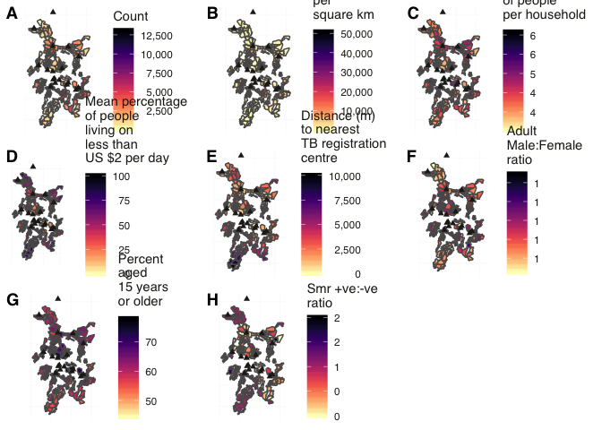<!-- -->

```r
ggsave(file="S1_Fig.pdf", width=12, height=12, dpi=300, 
       path = here("figures"))
```

<br>

##13. Correlation between variables.


```r
corrs <- dat %>%
  st_set_geometry(., NULL) %>%
  dplyr::select(total, mean_people_per_hh, popdens, m_f_adult_ratio,
         prop_adults, mwi11povcons200, clinic_distance, smr_ratio)
   

pairs(corrs)
```

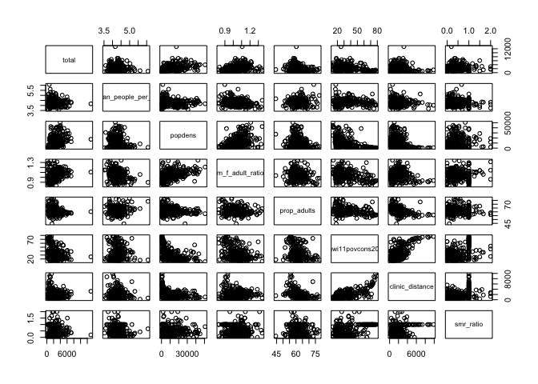<!-- -->


<br>

##14. Table 1: Characteristics of TB cases

Compare characteristics of cases located within and outside of HSA catchment areas.


```r
data("all_cases_sf", package="BlantyreTBEpi")

all_cases_sf$year <- fct_drop(all_cases_sf$year)


table1 <- tableby(resident ~ year + sex + age + tbclass + smearstatus + hivstatus +
                    lab_smear + lab_culture + lab_id + any_micro_confirm, data = all_cases_sf)

summary(table1)
```


|                                                     | HSA resident (N=3723) | Non HSA resident (N=286) | Total (N=4009)  | p value|
|:----------------------------------------------------|:---------------------:|:------------------------:|:---------------:|-------:|
|**year**                                             |                       |                          |                 |   0.032|
|&nbsp;&nbsp;&nbsp;2015                               |      994 (26.7%)      |        66 (23.1%)        |  1060 (26.4%)   |        |
|&nbsp;&nbsp;&nbsp;2016                               |     1314 (35.3%)      |       123 (43.0%)        |  1437 (35.8%)   |        |
|&nbsp;&nbsp;&nbsp;2017                               |     1415 (38.0%)      |        97 (33.9%)        |  1512 (37.7%)   |        |
|**sex**                                              |                       |                          |                 |   0.779|
|&nbsp;&nbsp;&nbsp;Female                             |     1368 (36.7%)      |       108 (37.8%)        |  1476 (36.8%)   |        |
|&nbsp;&nbsp;&nbsp;Male                               |     2355 (63.3%)      |       178 (62.2%)        |  2533 (63.2%)   |        |
|**age**                                              |                       |                          |                 |   0.770|
|&nbsp;&nbsp;&nbsp;Mean (SD)                          |    35.046 (13.489)    |     35.287 (11.608)      | 35.064 (13.362) |        |
|&nbsp;&nbsp;&nbsp;Range                              |    0.000 - 116.000    |      1.000 - 69.000      | 0.000 - 116.000 |        |
|**tbclass**                                          |                       |                          |                 |   0.472|
|&nbsp;&nbsp;&nbsp;N-Miss                             |          31           |            6             |       37        |        |
|&nbsp;&nbsp;&nbsp;Extrapulmonary TB                  |     1416 (38.4%)      |       114 (40.7%)        |  1530 (38.5%)   |        |
|&nbsp;&nbsp;&nbsp;Pulmonary TB                       |     2276 (61.6%)      |       166 (59.3%)        |  2442 (61.5%)   |        |
|**smearstatus**                                      |                       |                          |                 |   0.476|
|&nbsp;&nbsp;&nbsp;N-Miss                             |         2087          |           168            |      2255       |        |
|&nbsp;&nbsp;&nbsp;Negative                           |      618 (37.8%)      |        49 (41.5%)        |   667 (38.0%)   |        |
|&nbsp;&nbsp;&nbsp;Positive                           |     1018 (62.2%)      |        69 (58.5%)        |  1087 (62.0%)   |        |
|**hivstatus**                                        |                       |                          |                 |   0.086|
|&nbsp;&nbsp;&nbsp;N-Miss                             |           1           |            1             |        2        |        |
|&nbsp;&nbsp;&nbsp;HIV negative                       |     1146 (30.8%)      |        72 (25.3%)        |  1218 (30.4%)   |        |
|&nbsp;&nbsp;&nbsp;HIV positive                       |     2489 (66.9%)      |       203 (71.2%)        |  2692 (67.2%)   |        |
|&nbsp;&nbsp;&nbsp;Not done                           |       87 (2.3%)       |        10 (3.5%)         |    97 (2.4%)    |        |
|**lab_smear**                                        |                       |                          |                 |   0.486|
|&nbsp;&nbsp;&nbsp;N-Miss                             |          911          |            64            |       975       |        |
|&nbsp;&nbsp;&nbsp;Scanty positive                    |       18 (0.6%)       |         0 (0.0%)         |    18 (0.6%)    |        |
|&nbsp;&nbsp;&nbsp;Smear-negative                     |     1524 (54.2%)      |       122 (55.0%)        |  1646 (54.3%)   |        |
|&nbsp;&nbsp;&nbsp;Smear-positive                     |     1270 (45.2%)      |       100 (45.0%)        |  1370 (45.2%)   |        |
|**lab_culture**                                      |                       |                          |                 |   0.321|
|&nbsp;&nbsp;&nbsp;N-Miss                             |         1013          |            74            |      1087       |        |
|&nbsp;&nbsp;&nbsp;Culture-negative                   |     1113 (41.1%)      |        95 (44.8%)        |  1208 (41.3%)   |        |
|&nbsp;&nbsp;&nbsp;Culture-positive                   |     1597 (58.9%)      |       117 (55.2%)        |  1714 (58.7%)   |        |
|**lab_id**                                           |                       |                          |                 |   1.000|
|&nbsp;&nbsp;&nbsp;N-Miss                             |         2230          |           175            |      2405       |        |
|&nbsp;&nbsp;&nbsp;Culture-positive MTB               |     1493 (100.0%)     |       111 (100.0%)       |  1604 (100.0%)  |        |
|**any_micro_confirm**                                |                       |                          |                 |   0.814|
|&nbsp;&nbsp;&nbsp;Microbiologically-confirmed TB     |     1700 (45.7%)      |       128 (44.8%)        |  1828 (45.6%)   |        |
|&nbsp;&nbsp;&nbsp;Not microbiologically-confirmed TB |     2023 (54.3%)      |       158 (55.2%)        |  2181 (54.4%)   |        |


<br>
 
##15. Figure 2: TB case notification rates
 
Plot overall TB case notification rates.


```r
data("cnrs", package="BlantyreTBEpi")

cnr1 <- ggplot() +
  geom_sf(data=dat) +
  geom_sf(data=cnrs, aes(fill=cnr)) + 
  geom_sf(data=clinics, shape=17, colour="#22211d") +
  map_light() +
  scale_fill_distiller(palette = "Spectral",
                     name = "",
                     labels=comma,
                     limits = c(0,999)) +
  labs(x = NULL, 
       y = NULL) +
  facet_grid(~year, drop = FALSE) +
  theme(panel.background = element_rect(fill = "white", color = "#22211d" )) 

cnr1
```

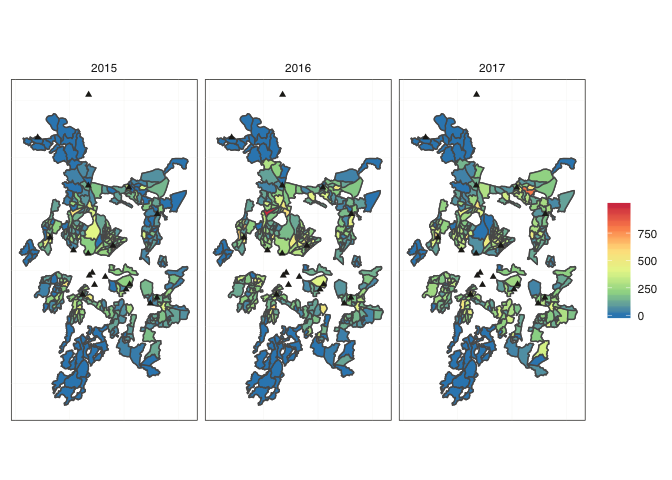<!-- -->

```r
ggsave(file="cnrs.pdf", width=12, height=6, dpi=300, 
       path = here("figures"))
```

Now plot microbiologically-confirmed TB case notification rate


```r
data("cnrs", package="BlantyreTBEpi")

cnr2 <- ggplot() +
  geom_sf(data=dat) +
  geom_sf(data=cnrs, aes(fill=micro_cnr)) + 
  geom_sf(data=clinics, shape=17, colour="#22211d") +
  map_light() +
  scale_fill_distiller(palette = "Spectral",
                     name = "",
                     labels=comma,
                     limits = c(0,500)) +
  labs(x = NULL, 
       y = NULL) +
  facet_grid(~year, drop = FALSE) +
  theme(panel.background = element_rect(fill = "white", color = "#22211d" ))

cnr2
```

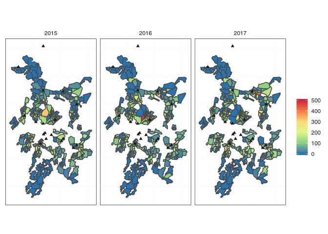<!-- -->

```r
ggsave(file="micro_cnrs.pdf", width=12, height=6, dpi=300, 
       path = here("figures"))
```


```r
plot_grid(cnr1, cnr2, labels = c("A", "B"), ncol = 1,
          label_fontfamily = "Helvetica")
```

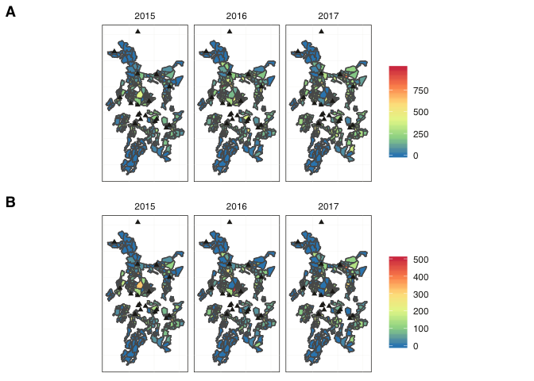<!-- -->

```r
ggsave(file="Figure2.pdf", width=10, height=8, dpi=300, 
       path = here("figures"))
```

<br>

##16. Spatial modelling

Make the spatial correlation matrices.


```r
#Make the adjacency matrix
#First find the centroids
centroids_sf <- st_centroid(st_geometry(dat), of_largest_polygon=TRUE)
zm <- class(st_geometry(centroids_sf)[[1]])[1]
if (zm %in% c("XYM", "XYZM"))
  centroids_sf <- st_zm(centroids_sf, drop=TRUE, what="ZM")
if (zm %in% c("XYZ"))
  centroids_sf <- st_zm(centroids_sf, drop=TRUE, what="ZM")

coords_sf <- st_coordinates(centroids_sf)

neigh1 <- knn2nb(knearneigh(coords_sf, k=1))
neigh2 <- knn2nb(knearneigh(coords_sf, k=2))
neigh3 <- knn2nb(knearneigh(coords_sf, k=3))
neigh4 <- knn2nb(knearneigh(coords_sf, k=4))
neigh5 <- knn2nb(knearneigh(coords_sf, k=5))
neigh6 <- knn2nb(knearneigh(coords_sf, k=6))


path <- paste(here("figures"), "S2_fig.pdf", sep="/")
pdf(path)

par(mfrow=c(2,3), mar=c(1,1,1,1))
plot.nb(neigh1, coords_sf, col="#036564", points=FALSE)
title(main="k=1", cex=2)
plot.nb(neigh2, coords_sf, col="#036564", points=FALSE)
title(main="k=2", cex=2)
plot.nb(neigh3, coords_sf, col="#036564", points=FALSE)
title(main="k=3", cex=2)
plot.nb(neigh4, coords_sf, col="#036564", points=FALSE)
title(main="k=4", cex=2)
plot.nb(neigh5, coords_sf, col="#036564", points=FALSE)
title(main="k=5", cex=2)
plot.nb(neigh6, coords_sf, col="#036564", points=FALSE)
title(main="k=6", cex=2)

dev.off()
```

```
## quartz_off_screen 
##                 2
```

```r
dat$hsa_area <- factor (1:nrow (dat))

#Create the neighbourhood matrices for each model
w1 <- nb2mat(make.sym.nb(neigh1), style="B")
rownames(w1) <- as.character (1:nrow (dat))

w2 <- nb2mat(make.sym.nb(neigh2), style="B")
rownames(w2) <- as.character (1:nrow (dat))

w3 <- nb2mat(make.sym.nb(neigh3), style="B")
rownames(w3) <- as.character (1:nrow (dat))

w4 <- nb2mat(make.sym.nb(neigh4), style="B")
rownames(w4) <- as.character (1:nrow (dat))

w5 <- nb2mat(make.sym.nb(neigh5), style="B")
rownames(w5) <- as.character (1:nrow (dat))

w6 <- nb2mat(make.sym.nb(neigh6), style="B")
rownames(w6) <- as.character (1:nrow (dat))
```

Take logarithm of some values


```r
dat <- dat %>%
  mutate(log_total = log(total))

dat <- dat %>%
  mutate(log_popdens = log(popdens))

dat <- dat %>%
  mutate(log_clinic_distance = log(clinic_distance))
```


Run all of the models, varying spatial autocorration prior


```r
prior <- c(prior_string("normal(0,10)", class="b"),
           prior_(~normal(0,10), class= ~Intercept))

all_0 <- brm(bf(n_cases ~
          mean_people_per_hh +
          log_popdens +
          log_clinic_distance +
          mwi11povcons200 +
          m_f_adult_ratio +
          prop_adults +
          smr_ratio +
          offset(log(total))),
          data=dat, 
          family='poisson',
          prior = prior,
          iter=4000, warmup=1000,
          chains=3,
          seed=1234,
          control=list(adapt_delta=0.95))
```

```
## Compiling the C++ model
```

```
## Start sampling
```

```
## 
## SAMPLING FOR MODEL 'poisson brms-model' NOW (CHAIN 1).
## 
## Gradient evaluation took 0.000109 seconds
## 1000 transitions using 10 leapfrog steps per transition would take 1.09 seconds.
## Adjust your expectations accordingly!
## 
## 
## Iteration:    1 / 4000 [  0%]  (Warmup)
## Iteration:  400 / 4000 [ 10%]  (Warmup)
## Iteration:  800 / 4000 [ 20%]  (Warmup)
## Iteration: 1001 / 4000 [ 25%]  (Sampling)
## Iteration: 1400 / 4000 [ 35%]  (Sampling)
## Iteration: 1800 / 4000 [ 45%]  (Sampling)
## Iteration: 2200 / 4000 [ 55%]  (Sampling)
## Iteration: 2600 / 4000 [ 65%]  (Sampling)
## Iteration: 3000 / 4000 [ 75%]  (Sampling)
## Iteration: 3400 / 4000 [ 85%]  (Sampling)
## Iteration: 3800 / 4000 [ 95%]  (Sampling)
## Iteration: 4000 / 4000 [100%]  (Sampling)
## 
##  Elapsed Time: 1.38088 seconds (Warm-up)
##                2.34543 seconds (Sampling)
##                3.7263 seconds (Total)
## 
## 
## SAMPLING FOR MODEL 'poisson brms-model' NOW (CHAIN 2).
## 
## Gradient evaluation took 5.4e-05 seconds
## 1000 transitions using 10 leapfrog steps per transition would take 0.54 seconds.
## Adjust your expectations accordingly!
## 
## 
## Iteration:    1 / 4000 [  0%]  (Warmup)
## Iteration:  400 / 4000 [ 10%]  (Warmup)
## Iteration:  800 / 4000 [ 20%]  (Warmup)
## Iteration: 1001 / 4000 [ 25%]  (Sampling)
## Iteration: 1400 / 4000 [ 35%]  (Sampling)
## Iteration: 1800 / 4000 [ 45%]  (Sampling)
## Iteration: 2200 / 4000 [ 55%]  (Sampling)
## Iteration: 2600 / 4000 [ 65%]  (Sampling)
## Iteration: 3000 / 4000 [ 75%]  (Sampling)
## Iteration: 3400 / 4000 [ 85%]  (Sampling)
## Iteration: 3800 / 4000 [ 95%]  (Sampling)
## Iteration: 4000 / 4000 [100%]  (Sampling)
## 
##  Elapsed Time: 3.21997 seconds (Warm-up)
##                2.59453 seconds (Sampling)
##                5.8145 seconds (Total)
## 
## 
## SAMPLING FOR MODEL 'poisson brms-model' NOW (CHAIN 3).
## 
## Gradient evaluation took 5.8e-05 seconds
## 1000 transitions using 10 leapfrog steps per transition would take 0.58 seconds.
## Adjust your expectations accordingly!
## 
## 
## Iteration:    1 / 4000 [  0%]  (Warmup)
## Iteration:  400 / 4000 [ 10%]  (Warmup)
## Iteration:  800 / 4000 [ 20%]  (Warmup)
## Iteration: 1001 / 4000 [ 25%]  (Sampling)
## Iteration: 1400 / 4000 [ 35%]  (Sampling)
## Iteration: 1800 / 4000 [ 45%]  (Sampling)
## Iteration: 2200 / 4000 [ 55%]  (Sampling)
## Iteration: 2600 / 4000 [ 65%]  (Sampling)
## Iteration: 3000 / 4000 [ 75%]  (Sampling)
## Iteration: 3400 / 4000 [ 85%]  (Sampling)
## Iteration: 3800 / 4000 [ 95%]  (Sampling)
## Iteration: 4000 / 4000 [100%]  (Sampling)
## 
##  Elapsed Time: 1.92433 seconds (Warm-up)
##                2.65769 seconds (Sampling)
##                4.58202 seconds (Total)
```

```r
all_1 <- brm(bf(n_cases ~
          mean_people_per_hh +
          log_popdens +
          log_clinic_distance +
          mwi11povcons200 +
          m_f_adult_ratio +
          prop_adults +
          smr_ratio +
          offset(log(total))),
          data=dat, 
          family='poisson',
          prior = prior,
          autocor=cor_car(w2, ~ 1 | c02hsaid1),
          iter=4000, warmup=1000,
          chains=3,
          seed=1234,
          control=list(adapt_delta=0.95))
```

```
## Compiling the C++ model
## Start sampling
```

```
## 
## SAMPLING FOR MODEL 'poisson brms-model' NOW (CHAIN 1).
## 
## Gradient evaluation took 0.000166 seconds
## 1000 transitions using 10 leapfrog steps per transition would take 1.66 seconds.
## Adjust your expectations accordingly!
## 
## 
## Iteration:    1 / 4000 [  0%]  (Warmup)
## Iteration:  400 / 4000 [ 10%]  (Warmup)
## Iteration:  800 / 4000 [ 20%]  (Warmup)
## Iteration: 1001 / 4000 [ 25%]  (Sampling)
## Iteration: 1400 / 4000 [ 35%]  (Sampling)
## Iteration: 1800 / 4000 [ 45%]  (Sampling)
## Iteration: 2200 / 4000 [ 55%]  (Sampling)
## Iteration: 2600 / 4000 [ 65%]  (Sampling)
## Iteration: 3000 / 4000 [ 75%]  (Sampling)
## Iteration: 3400 / 4000 [ 85%]  (Sampling)
## Iteration: 3800 / 4000 [ 95%]  (Sampling)
## Iteration: 4000 / 4000 [100%]  (Sampling)
## 
##  Elapsed Time: 9.31899 seconds (Warm-up)
##                30.4725 seconds (Sampling)
##                39.7915 seconds (Total)
## 
## 
## SAMPLING FOR MODEL 'poisson brms-model' NOW (CHAIN 2).
## 
## Gradient evaluation took 0.000118 seconds
## 1000 transitions using 10 leapfrog steps per transition would take 1.18 seconds.
## Adjust your expectations accordingly!
## 
## 
## Iteration:    1 / 4000 [  0%]  (Warmup)
## Iteration:  400 / 4000 [ 10%]  (Warmup)
## Iteration:  800 / 4000 [ 20%]  (Warmup)
## Iteration: 1001 / 4000 [ 25%]  (Sampling)
## Iteration: 1400 / 4000 [ 35%]  (Sampling)
## Iteration: 1800 / 4000 [ 45%]  (Sampling)
## Iteration: 2200 / 4000 [ 55%]  (Sampling)
## Iteration: 2600 / 4000 [ 65%]  (Sampling)
## Iteration: 3000 / 4000 [ 75%]  (Sampling)
## Iteration: 3400 / 4000 [ 85%]  (Sampling)
## Iteration: 3800 / 4000 [ 95%]  (Sampling)
## Iteration: 4000 / 4000 [100%]  (Sampling)
## 
##  Elapsed Time: 21.1779 seconds (Warm-up)
##                13.0551 seconds (Sampling)
##                34.233 seconds (Total)
## 
## 
## SAMPLING FOR MODEL 'poisson brms-model' NOW (CHAIN 3).
## 
## Gradient evaluation took 0.000168 seconds
## 1000 transitions using 10 leapfrog steps per transition would take 1.68 seconds.
## Adjust your expectations accordingly!
## 
## 
## Iteration:    1 / 4000 [  0%]  (Warmup)
## Iteration:  400 / 4000 [ 10%]  (Warmup)
## Iteration:  800 / 4000 [ 20%]  (Warmup)
## Iteration: 1001 / 4000 [ 25%]  (Sampling)
## Iteration: 1400 / 4000 [ 35%]  (Sampling)
## Iteration: 1800 / 4000 [ 45%]  (Sampling)
## Iteration: 2200 / 4000 [ 55%]  (Sampling)
## Iteration: 2600 / 4000 [ 65%]  (Sampling)
## Iteration: 3000 / 4000 [ 75%]  (Sampling)
## Iteration: 3400 / 4000 [ 85%]  (Sampling)
## Iteration: 3800 / 4000 [ 95%]  (Sampling)
## Iteration: 4000 / 4000 [100%]  (Sampling)
## 
##  Elapsed Time: 8.54884 seconds (Warm-up)
##                20.5467 seconds (Sampling)
##                29.0956 seconds (Total)
```

```r
all_2 <- brm(bf(n_cases ~
          mean_people_per_hh +
          log_popdens +
          log_clinic_distance +
          mwi11povcons200 +
          m_f_adult_ratio +
          prop_adults +
          smr_ratio +
          offset(log(total))),
          data=dat, 
          family='poisson',
          prior = prior,
          autocor=cor_car(w2, ~ 1 | c02hsaid1),
          iter=4000, warmup=1000,
          chains=3,
          seed=1234,
          control=list(adapt_delta=0.95))
```

```
## Compiling the C++ model
## Start sampling
```

```
## 
## SAMPLING FOR MODEL 'poisson brms-model' NOW (CHAIN 1).
## 
## Gradient evaluation took 0.000182 seconds
## 1000 transitions using 10 leapfrog steps per transition would take 1.82 seconds.
## Adjust your expectations accordingly!
## 
## 
## Iteration:    1 / 4000 [  0%]  (Warmup)
## Iteration:  400 / 4000 [ 10%]  (Warmup)
## Iteration:  800 / 4000 [ 20%]  (Warmup)
## Iteration: 1001 / 4000 [ 25%]  (Sampling)
## Iteration: 1400 / 4000 [ 35%]  (Sampling)
## Iteration: 1800 / 4000 [ 45%]  (Sampling)
## Iteration: 2200 / 4000 [ 55%]  (Sampling)
## Iteration: 2600 / 4000 [ 65%]  (Sampling)
## Iteration: 3000 / 4000 [ 75%]  (Sampling)
## Iteration: 3400 / 4000 [ 85%]  (Sampling)
## Iteration: 3800 / 4000 [ 95%]  (Sampling)
## Iteration: 4000 / 4000 [100%]  (Sampling)
## 
##  Elapsed Time: 8.58559 seconds (Warm-up)
##                28.4995 seconds (Sampling)
##                37.0851 seconds (Total)
## 
## 
## SAMPLING FOR MODEL 'poisson brms-model' NOW (CHAIN 2).
## 
## Gradient evaluation took 0.000119 seconds
## 1000 transitions using 10 leapfrog steps per transition would take 1.19 seconds.
## Adjust your expectations accordingly!
## 
## 
## Iteration:    1 / 4000 [  0%]  (Warmup)
## Iteration:  400 / 4000 [ 10%]  (Warmup)
## Iteration:  800 / 4000 [ 20%]  (Warmup)
## Iteration: 1001 / 4000 [ 25%]  (Sampling)
## Iteration: 1400 / 4000 [ 35%]  (Sampling)
## Iteration: 1800 / 4000 [ 45%]  (Sampling)
## Iteration: 2200 / 4000 [ 55%]  (Sampling)
## Iteration: 2600 / 4000 [ 65%]  (Sampling)
## Iteration: 3000 / 4000 [ 75%]  (Sampling)
## Iteration: 3400 / 4000 [ 85%]  (Sampling)
## Iteration: 3800 / 4000 [ 95%]  (Sampling)
## Iteration: 4000 / 4000 [100%]  (Sampling)
## 
##  Elapsed Time: 22.362 seconds (Warm-up)
##                13.6208 seconds (Sampling)
##                35.9829 seconds (Total)
## 
## 
## SAMPLING FOR MODEL 'poisson brms-model' NOW (CHAIN 3).
## 
## Gradient evaluation took 0.000143 seconds
## 1000 transitions using 10 leapfrog steps per transition would take 1.43 seconds.
## Adjust your expectations accordingly!
## 
## 
## Iteration:    1 / 4000 [  0%]  (Warmup)
## Iteration:  400 / 4000 [ 10%]  (Warmup)
## Iteration:  800 / 4000 [ 20%]  (Warmup)
## Iteration: 1001 / 4000 [ 25%]  (Sampling)
## Iteration: 1400 / 4000 [ 35%]  (Sampling)
## Iteration: 1800 / 4000 [ 45%]  (Sampling)
## Iteration: 2200 / 4000 [ 55%]  (Sampling)
## Iteration: 2600 / 4000 [ 65%]  (Sampling)
## Iteration: 3000 / 4000 [ 75%]  (Sampling)
## Iteration: 3400 / 4000 [ 85%]  (Sampling)
## Iteration: 3800 / 4000 [ 95%]  (Sampling)
## Iteration: 4000 / 4000 [100%]  (Sampling)
## 
##  Elapsed Time: 8.75792 seconds (Warm-up)
##                22.6542 seconds (Sampling)
##                31.4121 seconds (Total)
```

```r
all_3 <- brm(bf(n_cases ~
          mean_people_per_hh +
          log_popdens +
          log_clinic_distance +
          mwi11povcons200 +
          m_f_adult_ratio +
          prop_adults +
          smr_ratio +
          offset(log(total))),
          data=dat, 
          family='poisson',
          prior = prior,
          autocor=cor_car(w3, ~ 1 | c02hsaid1),
          iter=4000, warmup=1000,
          chains=3,
          seed=1234,
          control=list(adapt_delta=0.95))
```

```
## Compiling the C++ model
## Start sampling
```

```
## 
## SAMPLING FOR MODEL 'poisson brms-model' NOW (CHAIN 1).
## 
## Gradient evaluation took 0.000254 seconds
## 1000 transitions using 10 leapfrog steps per transition would take 2.54 seconds.
## Adjust your expectations accordingly!
## 
## 
## Iteration:    1 / 4000 [  0%]  (Warmup)
## Iteration:  400 / 4000 [ 10%]  (Warmup)
## Iteration:  800 / 4000 [ 20%]  (Warmup)
## Iteration: 1001 / 4000 [ 25%]  (Sampling)
## Iteration: 1400 / 4000 [ 35%]  (Sampling)
## Iteration: 1800 / 4000 [ 45%]  (Sampling)
## Iteration: 2200 / 4000 [ 55%]  (Sampling)
## Iteration: 2600 / 4000 [ 65%]  (Sampling)
## Iteration: 3000 / 4000 [ 75%]  (Sampling)
## Iteration: 3400 / 4000 [ 85%]  (Sampling)
## Iteration: 3800 / 4000 [ 95%]  (Sampling)
## Iteration: 4000 / 4000 [100%]  (Sampling)
## 
##  Elapsed Time: 9.96623 seconds (Warm-up)
##                14.3446 seconds (Sampling)
##                24.3108 seconds (Total)
## 
## 
## SAMPLING FOR MODEL 'poisson brms-model' NOW (CHAIN 2).
## 
## Gradient evaluation took 0.000125 seconds
## 1000 transitions using 10 leapfrog steps per transition would take 1.25 seconds.
## Adjust your expectations accordingly!
## 
## 
## Iteration:    1 / 4000 [  0%]  (Warmup)
## Iteration:  400 / 4000 [ 10%]  (Warmup)
## Iteration:  800 / 4000 [ 20%]  (Warmup)
## Iteration: 1001 / 4000 [ 25%]  (Sampling)
## Iteration: 1400 / 4000 [ 35%]  (Sampling)
## Iteration: 1800 / 4000 [ 45%]  (Sampling)
## Iteration: 2200 / 4000 [ 55%]  (Sampling)
## Iteration: 2600 / 4000 [ 65%]  (Sampling)
## Iteration: 3000 / 4000 [ 75%]  (Sampling)
## Iteration: 3400 / 4000 [ 85%]  (Sampling)
## Iteration: 3800 / 4000 [ 95%]  (Sampling)
## Iteration: 4000 / 4000 [100%]  (Sampling)
## 
##  Elapsed Time: 23.8226 seconds (Warm-up)
##                12.7395 seconds (Sampling)
##                36.5622 seconds (Total)
## 
## 
## SAMPLING FOR MODEL 'poisson brms-model' NOW (CHAIN 3).
## 
## Gradient evaluation took 0.000178 seconds
## 1000 transitions using 10 leapfrog steps per transition would take 1.78 seconds.
## Adjust your expectations accordingly!
## 
## 
## Iteration:    1 / 4000 [  0%]  (Warmup)
## Iteration:  400 / 4000 [ 10%]  (Warmup)
## Iteration:  800 / 4000 [ 20%]  (Warmup)
## Iteration: 1001 / 4000 [ 25%]  (Sampling)
## Iteration: 1400 / 4000 [ 35%]  (Sampling)
## Iteration: 1800 / 4000 [ 45%]  (Sampling)
## Iteration: 2200 / 4000 [ 55%]  (Sampling)
## Iteration: 2600 / 4000 [ 65%]  (Sampling)
## Iteration: 3000 / 4000 [ 75%]  (Sampling)
## Iteration: 3400 / 4000 [ 85%]  (Sampling)
## Iteration: 3800 / 4000 [ 95%]  (Sampling)
## Iteration: 4000 / 4000 [100%]  (Sampling)
## 
##  Elapsed Time: 10.8909 seconds (Warm-up)
##                12.9006 seconds (Sampling)
##                23.7915 seconds (Total)
```

```r
all_4 <- brm(bf(n_cases ~
          mean_people_per_hh +
          log_popdens +
          log_clinic_distance +
          mwi11povcons200 +
          m_f_adult_ratio +
          prop_adults +
          smr_ratio +
          offset(log(total))),
          data=dat, 
          family='poisson',
          prior = prior,
          autocor=cor_car(w4, ~ 1 | c02hsaid1),
          iter=4000, warmup=1000,
          chains=3,
          seed=1234,
          control=list(adapt_delta=0.95))
```

```
## Compiling the C++ model
## Start sampling
```

```
## 
## SAMPLING FOR MODEL 'poisson brms-model' NOW (CHAIN 1).
## 
## Gradient evaluation took 0.000222 seconds
## 1000 transitions using 10 leapfrog steps per transition would take 2.22 seconds.
## Adjust your expectations accordingly!
## 
## 
## Iteration:    1 / 4000 [  0%]  (Warmup)
## Iteration:  400 / 4000 [ 10%]  (Warmup)
## Iteration:  800 / 4000 [ 20%]  (Warmup)
## Iteration: 1001 / 4000 [ 25%]  (Sampling)
## Iteration: 1400 / 4000 [ 35%]  (Sampling)
## Iteration: 1800 / 4000 [ 45%]  (Sampling)
## Iteration: 2200 / 4000 [ 55%]  (Sampling)
## Iteration: 2600 / 4000 [ 65%]  (Sampling)
## Iteration: 3000 / 4000 [ 75%]  (Sampling)
## Iteration: 3400 / 4000 [ 85%]  (Sampling)
## Iteration: 3800 / 4000 [ 95%]  (Sampling)
## Iteration: 4000 / 4000 [100%]  (Sampling)
## 
##  Elapsed Time: 12.5882 seconds (Warm-up)
##                26.89 seconds (Sampling)
##                39.4782 seconds (Total)
## 
## 
## SAMPLING FOR MODEL 'poisson brms-model' NOW (CHAIN 2).
## 
## Gradient evaluation took 0.000139 seconds
## 1000 transitions using 10 leapfrog steps per transition would take 1.39 seconds.
## Adjust your expectations accordingly!
## 
## 
## Iteration:    1 / 4000 [  0%]  (Warmup)
## Iteration:  400 / 4000 [ 10%]  (Warmup)
## Iteration:  800 / 4000 [ 20%]  (Warmup)
## Iteration: 1001 / 4000 [ 25%]  (Sampling)
## Iteration: 1400 / 4000 [ 35%]  (Sampling)
## Iteration: 1800 / 4000 [ 45%]  (Sampling)
## Iteration: 2200 / 4000 [ 55%]  (Sampling)
## Iteration: 2600 / 4000 [ 65%]  (Sampling)
## Iteration: 3000 / 4000 [ 75%]  (Sampling)
## Iteration: 3400 / 4000 [ 85%]  (Sampling)
## Iteration: 3800 / 4000 [ 95%]  (Sampling)
## Iteration: 4000 / 4000 [100%]  (Sampling)
## 
##  Elapsed Time: 27.5635 seconds (Warm-up)
##                39.7198 seconds (Sampling)
##                67.2834 seconds (Total)
## 
## 
## SAMPLING FOR MODEL 'poisson brms-model' NOW (CHAIN 3).
## 
## Gradient evaluation took 0.000341 seconds
## 1000 transitions using 10 leapfrog steps per transition would take 3.41 seconds.
## Adjust your expectations accordingly!
## 
## 
## Iteration:    1 / 4000 [  0%]  (Warmup)
## Iteration:  400 / 4000 [ 10%]  (Warmup)
## Iteration:  800 / 4000 [ 20%]  (Warmup)
## Iteration: 1001 / 4000 [ 25%]  (Sampling)
## Iteration: 1400 / 4000 [ 35%]  (Sampling)
## Iteration: 1800 / 4000 [ 45%]  (Sampling)
## Iteration: 2200 / 4000 [ 55%]  (Sampling)
## Iteration: 2600 / 4000 [ 65%]  (Sampling)
## Iteration: 3000 / 4000 [ 75%]  (Sampling)
## Iteration: 3400 / 4000 [ 85%]  (Sampling)
## Iteration: 3800 / 4000 [ 95%]  (Sampling)
## Iteration: 4000 / 4000 [100%]  (Sampling)
## 
##  Elapsed Time: 12.8013 seconds (Warm-up)
##                25.9984 seconds (Sampling)
##                38.7996 seconds (Total)
```

```r
all_5 <- brm(bf(n_cases ~
          mean_people_per_hh +
          log_popdens +
          log_clinic_distance +
          mwi11povcons200 +
          m_f_adult_ratio +
          prop_adults +
          smr_ratio +
          offset(log(total))),
          data=dat, 
          family='poisson',
          prior = prior,
          autocor=cor_car(w5, ~ 1 | c02hsaid1),
          iter=4000, warmup=1000,
          chains=3,
          seed=1234,
          control=list(adapt_delta=0.95))
```

```
## Compiling the C++ model
## Start sampling
```

```
## 
## SAMPLING FOR MODEL 'poisson brms-model' NOW (CHAIN 1).
## 
## Gradient evaluation took 0.000219 seconds
## 1000 transitions using 10 leapfrog steps per transition would take 2.19 seconds.
## Adjust your expectations accordingly!
## 
## 
## Iteration:    1 / 4000 [  0%]  (Warmup)
## Iteration:  400 / 4000 [ 10%]  (Warmup)
## Iteration:  800 / 4000 [ 20%]  (Warmup)
## Iteration: 1001 / 4000 [ 25%]  (Sampling)
## Iteration: 1400 / 4000 [ 35%]  (Sampling)
## Iteration: 1800 / 4000 [ 45%]  (Sampling)
## Iteration: 2200 / 4000 [ 55%]  (Sampling)
## Iteration: 2600 / 4000 [ 65%]  (Sampling)
## Iteration: 3000 / 4000 [ 75%]  (Sampling)
## Iteration: 3400 / 4000 [ 85%]  (Sampling)
## Iteration: 3800 / 4000 [ 95%]  (Sampling)
## Iteration: 4000 / 4000 [100%]  (Sampling)
## 
##  Elapsed Time: 11.8067 seconds (Warm-up)
##                12.8377 seconds (Sampling)
##                24.6445 seconds (Total)
## 
## 
## SAMPLING FOR MODEL 'poisson brms-model' NOW (CHAIN 2).
## 
## Gradient evaluation took 0.000132 seconds
## 1000 transitions using 10 leapfrog steps per transition would take 1.32 seconds.
## Adjust your expectations accordingly!
## 
## 
## Iteration:    1 / 4000 [  0%]  (Warmup)
## Iteration:  400 / 4000 [ 10%]  (Warmup)
## Iteration:  800 / 4000 [ 20%]  (Warmup)
## Iteration: 1001 / 4000 [ 25%]  (Sampling)
## Iteration: 1400 / 4000 [ 35%]  (Sampling)
## Iteration: 1800 / 4000 [ 45%]  (Sampling)
## Iteration: 2200 / 4000 [ 55%]  (Sampling)
## Iteration: 2600 / 4000 [ 65%]  (Sampling)
## Iteration: 3000 / 4000 [ 75%]  (Sampling)
## Iteration: 3400 / 4000 [ 85%]  (Sampling)
## Iteration: 3800 / 4000 [ 95%]  (Sampling)
## Iteration: 4000 / 4000 [100%]  (Sampling)
## 
##  Elapsed Time: 26.1182 seconds (Warm-up)
##                31.8994 seconds (Sampling)
##                58.0175 seconds (Total)
## 
## 
## SAMPLING FOR MODEL 'poisson brms-model' NOW (CHAIN 3).
## 
## Gradient evaluation took 0.000148 seconds
## 1000 transitions using 10 leapfrog steps per transition would take 1.48 seconds.
## Adjust your expectations accordingly!
## 
## 
## Iteration:    1 / 4000 [  0%]  (Warmup)
## Iteration:  400 / 4000 [ 10%]  (Warmup)
## Iteration:  800 / 4000 [ 20%]  (Warmup)
## Iteration: 1001 / 4000 [ 25%]  (Sampling)
## Iteration: 1400 / 4000 [ 35%]  (Sampling)
## Iteration: 1800 / 4000 [ 45%]  (Sampling)
## Iteration: 2200 / 4000 [ 55%]  (Sampling)
## Iteration: 2600 / 4000 [ 65%]  (Sampling)
## Iteration: 3000 / 4000 [ 75%]  (Sampling)
## Iteration: 3400 / 4000 [ 85%]  (Sampling)
## Iteration: 3800 / 4000 [ 95%]  (Sampling)
## Iteration: 4000 / 4000 [100%]  (Sampling)
## 
##  Elapsed Time: 10.7237 seconds (Warm-up)
##                26.1674 seconds (Sampling)
##                36.8911 seconds (Total)
```

```r
all_6 <- brm(bf(n_cases ~
          mean_people_per_hh +
          log_popdens +
          log_clinic_distance +
          mwi11povcons200 +
          m_f_adult_ratio +
          prop_adults +
          smr_ratio +
          offset(log(total))),
          data=dat, 
          family='poisson',
          prior = prior,
          autocor=cor_car(w6, ~ 1 | c02hsaid1),
          iter=4000, warmup=1000,
          chains=3,
          seed=1234,
          control=list(adapt_delta=0.95))
```

```
## Compiling the C++ model
## Start sampling
```

```
## 
## SAMPLING FOR MODEL 'poisson brms-model' NOW (CHAIN 1).
## 
## Gradient evaluation took 0.000258 seconds
## 1000 transitions using 10 leapfrog steps per transition would take 2.58 seconds.
## Adjust your expectations accordingly!
## 
## 
## Iteration:    1 / 4000 [  0%]  (Warmup)
## Iteration:  400 / 4000 [ 10%]  (Warmup)
## Iteration:  800 / 4000 [ 20%]  (Warmup)
## Iteration: 1001 / 4000 [ 25%]  (Sampling)
## Iteration: 1400 / 4000 [ 35%]  (Sampling)
## Iteration: 1800 / 4000 [ 45%]  (Sampling)
## Iteration: 2200 / 4000 [ 55%]  (Sampling)
## Iteration: 2600 / 4000 [ 65%]  (Sampling)
## Iteration: 3000 / 4000 [ 75%]  (Sampling)
## Iteration: 3400 / 4000 [ 85%]  (Sampling)
## Iteration: 3800 / 4000 [ 95%]  (Sampling)
## Iteration: 4000 / 4000 [100%]  (Sampling)
## 
##  Elapsed Time: 11.1372 seconds (Warm-up)
##                14.3618 seconds (Sampling)
##                25.499 seconds (Total)
## 
## 
## SAMPLING FOR MODEL 'poisson brms-model' NOW (CHAIN 2).
## 
## Gradient evaluation took 0.000141 seconds
## 1000 transitions using 10 leapfrog steps per transition would take 1.41 seconds.
## Adjust your expectations accordingly!
## 
## 
## Iteration:    1 / 4000 [  0%]  (Warmup)
## Iteration:  400 / 4000 [ 10%]  (Warmup)
## Iteration:  800 / 4000 [ 20%]  (Warmup)
## Iteration: 1001 / 4000 [ 25%]  (Sampling)
## Iteration: 1400 / 4000 [ 35%]  (Sampling)
## Iteration: 1800 / 4000 [ 45%]  (Sampling)
## Iteration: 2200 / 4000 [ 55%]  (Sampling)
## Iteration: 2600 / 4000 [ 65%]  (Sampling)
## Iteration: 3000 / 4000 [ 75%]  (Sampling)
## Iteration: 3400 / 4000 [ 85%]  (Sampling)
## Iteration: 3800 / 4000 [ 95%]  (Sampling)
## Iteration: 4000 / 4000 [100%]  (Sampling)
## 
##  Elapsed Time: 27.6823 seconds (Warm-up)
##                31.1908 seconds (Sampling)
##                58.8731 seconds (Total)
## 
## 
## SAMPLING FOR MODEL 'poisson brms-model' NOW (CHAIN 3).
## 
## Gradient evaluation took 0.00014 seconds
## 1000 transitions using 10 leapfrog steps per transition would take 1.4 seconds.
## Adjust your expectations accordingly!
## 
## 
## Iteration:    1 / 4000 [  0%]  (Warmup)
## Iteration:  400 / 4000 [ 10%]  (Warmup)
## Iteration:  800 / 4000 [ 20%]  (Warmup)
## Iteration: 1001 / 4000 [ 25%]  (Sampling)
## Iteration: 1400 / 4000 [ 35%]  (Sampling)
## Iteration: 1800 / 4000 [ 45%]  (Sampling)
## Iteration: 2200 / 4000 [ 55%]  (Sampling)
## Iteration: 2600 / 4000 [ 65%]  (Sampling)
## Iteration: 3000 / 4000 [ 75%]  (Sampling)
## Iteration: 3400 / 4000 [ 85%]  (Sampling)
## Iteration: 3800 / 4000 [ 95%]  (Sampling)
## Iteration: 4000 / 4000 [100%]  (Sampling)
## 
##  Elapsed Time: 13.2808 seconds (Warm-up)
##                28.2386 seconds (Sampling)
##                41.5194 seconds (Total)
```

```r
all_0_ic <- waic(all_0)
all_1_ic <- waic(all_1)
all_2_ic <- waic(all_2)
all_3_ic <- waic(all_3)
all_4_ic <- waic(all_4)
all_5_ic <- waic(all_5)
all_6_ic <- waic(all_6)

compare_ic(all_0_ic, all_1_ic, all_2_ic, all_3_ic, all_4_ic, all_5_ic, all_6_ic)
```

```
##                  WAIC    SE
## all_0         2165.02 82.76
## all_1         1663.98 37.66
## all_2         1663.98 37.66
## all_3         1656.34 35.73
## all_4         1645.00 35.95
## all_5         1641.87 35.08
## all_6         1641.05 34.35
## all_0 - all_1  501.04 64.32
## all_0 - all_2  501.04 64.32
## all_0 - all_3  508.69 64.89
## all_0 - all_4  520.02 65.26
## all_0 - all_5  523.15 65.30
## all_0 - all_6  523.97 64.85
## all_1 - all_2    0.00  0.00
## all_1 - all_3    7.65  6.56
## all_1 - all_4   18.98  8.23
## all_1 - all_5   22.12  9.69
## all_1 - all_6   22.93 11.00
## all_2 - all_3    7.65  6.56
## all_2 - all_4   18.98  8.23
## all_2 - all_5   22.12  9.69
## all_2 - all_6   22.93 11.00
## all_3 - all_4   11.33  5.26
## all_3 - all_5   14.47  5.70
## all_3 - all_6   15.28  6.83
## all_4 - all_5    3.13  4.30
## all_4 - all_6    3.95  6.14
## all_5 - all_6    0.82  3.87
```

```r
waics0 <- as.tibble(unlist(all_0_ic)) %>% rownames_to_column() %>% filter(rowname == "waic") %>%
  mutate(model="k0") %>%
  dplyr::select(model, value)

waics1 <- as.tibble(unlist(all_1_ic)) %>% rownames_to_column() %>% filter(rowname == "waic") %>%
  mutate(model="k1") %>%
  dplyr::select(model, value)

waics2 <- as.tibble(unlist(all_2_ic)) %>% rownames_to_column() %>% filter(rowname == "waic") %>%
  mutate(model="k2") %>%
  dplyr::select(model, value)

waics3 <- as.tibble(unlist(all_3_ic)) %>% rownames_to_column() %>% filter(rowname == "waic") %>%
  mutate(model="k3") %>%
  dplyr::select(model, value)

waics4 <- as.tibble(unlist(all_4_ic)) %>% rownames_to_column() %>% filter(rowname == "waic") %>%
  mutate(model="k4") %>%
  dplyr::select(model, value)

waics5 <- as.tibble(unlist(all_5_ic)) %>% rownames_to_column() %>% filter(rowname == "waic") %>%
  mutate(model="k5") %>%
  dplyr::select(model, value)

waics6 <- as.tibble(unlist(all_6_ic)) %>% rownames_to_column() %>% filter(rowname == "waic") %>%
  mutate(model="k6") %>%
  dplyr::select(model, value)

waics <- bind_rows(waics0, waics1, waics2, waics3, waics4, waics5, waics6)
waics <- waics %>% mutate(value = as.numeric(value)) %>% mutate(value = round(value, digits=2))

ests_all_0<- tidy(exp(fixef(all_0)))
ests_all_0 <- ests_all_0 %>%
  mutate(model="k0")

ests_all_1<- tidy(exp(fixef(all_1)))
ests_all_1 <- ests_all_1 %>%
  mutate(model="k1")

ests_all_2<- tidy(exp(fixef(all_2)))
ests_all_2 <- ests_all_2 %>%
  mutate(model="k2")

ests_all_3<- tidy(exp(fixef(all_3)))
ests_all_3 <- ests_all_3 %>%
  mutate(model="k3")

ests_all_4<- tidy(exp(fixef(all_4)))
ests_all_4 <- ests_all_4 %>%
  mutate(model="k4")

ests_all_5<- tidy(exp(fixef(all_5)))
ests_all_5 <- ests_all_5 %>%
  mutate(model="k5")

ests_all_6<- tidy(exp(fixef(all_6)))
ests_all_6 <- ests_all_6 %>%
  mutate(model="k6")

all_all <- bind_rows(ests_all_0, ests_all_1, ests_all_2, ests_all_3, ests_all_4, ests_all_5, ests_all_6)

all_all <- left_join(all_all, waics)
```

```
## Joining, by = "model"
```

```r
all_all <- all_all %>% mutate(value = as.numeric(value)) %>% mutate(value = round(value, digits=2))

s3a <- all_all %>%
  filter(`.rownames` != "Intercept") %>%
  ggplot() +
  geom_pointrange(aes(x=.rownames, y=Estimate, ymin=Q2.5, ymax=Q97.5, group=fct_rev(model), colour=model),
                  position=position_dodge(width=1)) +
  coord_flip() +
  geom_hline(yintercept = 1, linetype="dashed") +
  ylab("") +
  xlab("") +
  scale_x_discrete(labels = c("Log(10) distance to clinic",
                              "Log(10) population density",
                              "M:F adult ratio",
                              "Mean people per household",
                              "Percentage living in poverty",
                              "Percentage adults",
                              "Smear pos:smear neg ratio")) +
  scale_color_economist(name = "Model: WAIC", labels = paste(levels(as.factor(all_all$model)), waics$value, sep=": ")) +
  scale_y_sqrt(breaks=c(0.2,0.4,0.6,0.8,1.0,1.2,1.4,1.6), limits=c(0,1.6)) +
  theme_bw() +
  theme(text =  element_text(size=14))

ggsave(file="s3a_fig.pdf", height = 10, width = 10, dpi=300, 
       path = here("figures"))
```


```r
prior <- c(prior_string("normal(0,10)", class="b"),
           prior_(~normal(0,10), class= ~Intercept))

micro_0 <- brm(bf(n_micro_cases ~
          mean_people_per_hh +
          log_popdens +
          log_clinic_distance +
          mwi11povcons200 +
          m_f_adult_ratio +
          prop_adults +
          smr_ratio +
          offset(log(total))),
          data=dat, 
          family='poisson',
          prior = prior,
          iter=4000, warmup=1000,
          chains=3,
          seed=1234,
          control=list(adapt_delta=0.95))
```

```
## Compiling the C++ model
```

```
## Start sampling
```

```
## 
## SAMPLING FOR MODEL 'poisson brms-model' NOW (CHAIN 1).
## 
## Gradient evaluation took 7.9e-05 seconds
## 1000 transitions using 10 leapfrog steps per transition would take 0.79 seconds.
## Adjust your expectations accordingly!
## 
## 
## Iteration:    1 / 4000 [  0%]  (Warmup)
## Iteration:  400 / 4000 [ 10%]  (Warmup)
## Iteration:  800 / 4000 [ 20%]  (Warmup)
## Iteration: 1001 / 4000 [ 25%]  (Sampling)
## Iteration: 1400 / 4000 [ 35%]  (Sampling)
## Iteration: 1800 / 4000 [ 45%]  (Sampling)
## Iteration: 2200 / 4000 [ 55%]  (Sampling)
## Iteration: 2600 / 4000 [ 65%]  (Sampling)
## Iteration: 3000 / 4000 [ 75%]  (Sampling)
## Iteration: 3400 / 4000 [ 85%]  (Sampling)
## Iteration: 3800 / 4000 [ 95%]  (Sampling)
## Iteration: 4000 / 4000 [100%]  (Sampling)
## 
##  Elapsed Time: 1.41366 seconds (Warm-up)
##                2.34022 seconds (Sampling)
##                3.75387 seconds (Total)
## 
## 
## SAMPLING FOR MODEL 'poisson brms-model' NOW (CHAIN 2).
## 
## Gradient evaluation took 5.4e-05 seconds
## 1000 transitions using 10 leapfrog steps per transition would take 0.54 seconds.
## Adjust your expectations accordingly!
## 
## 
## Iteration:    1 / 4000 [  0%]  (Warmup)
## Iteration:  400 / 4000 [ 10%]  (Warmup)
## Iteration:  800 / 4000 [ 20%]  (Warmup)
## Iteration: 1001 / 4000 [ 25%]  (Sampling)
## Iteration: 1400 / 4000 [ 35%]  (Sampling)
## Iteration: 1800 / 4000 [ 45%]  (Sampling)
## Iteration: 2200 / 4000 [ 55%]  (Sampling)
## Iteration: 2600 / 4000 [ 65%]  (Sampling)
## Iteration: 3000 / 4000 [ 75%]  (Sampling)
## Iteration: 3400 / 4000 [ 85%]  (Sampling)
## Iteration: 3800 / 4000 [ 95%]  (Sampling)
## Iteration: 4000 / 4000 [100%]  (Sampling)
## 
##  Elapsed Time: 3.82608 seconds (Warm-up)
##                2.45122 seconds (Sampling)
##                6.2773 seconds (Total)
## 
## 
## SAMPLING FOR MODEL 'poisson brms-model' NOW (CHAIN 3).
## 
## Gradient evaluation took 5.4e-05 seconds
## 1000 transitions using 10 leapfrog steps per transition would take 0.54 seconds.
## Adjust your expectations accordingly!
## 
## 
## Iteration:    1 / 4000 [  0%]  (Warmup)
## Iteration:  400 / 4000 [ 10%]  (Warmup)
## Iteration:  800 / 4000 [ 20%]  (Warmup)
## Iteration: 1001 / 4000 [ 25%]  (Sampling)
## Iteration: 1400 / 4000 [ 35%]  (Sampling)
## Iteration: 1800 / 4000 [ 45%]  (Sampling)
## Iteration: 2200 / 4000 [ 55%]  (Sampling)
## Iteration: 2600 / 4000 [ 65%]  (Sampling)
## Iteration: 3000 / 4000 [ 75%]  (Sampling)
## Iteration: 3400 / 4000 [ 85%]  (Sampling)
## Iteration: 3800 / 4000 [ 95%]  (Sampling)
## Iteration: 4000 / 4000 [100%]  (Sampling)
## 
##  Elapsed Time: 1.66138 seconds (Warm-up)
##                2.32355 seconds (Sampling)
##                3.98494 seconds (Total)
```

```r
micro_1 <- brm(bf(n_micro_cases ~
          mean_people_per_hh +
          log_popdens +
          log_clinic_distance +
          mwi11povcons200 +
          m_f_adult_ratio +
          prop_adults +
          smr_ratio +
          offset(log(total))),
          data=dat, 
          family='poisson',
          prior = prior,
          autocor=cor_car(w2, ~ 1 | c02hsaid1),
          iter=4000, warmup=1000,
          chains=3,
          seed=1234,
          control=list(adapt_delta=0.95))
```

```
## Compiling the C++ model
## Start sampling
```

```
## 
## SAMPLING FOR MODEL 'poisson brms-model' NOW (CHAIN 1).
## 
## Gradient evaluation took 0.000156 seconds
## 1000 transitions using 10 leapfrog steps per transition would take 1.56 seconds.
## Adjust your expectations accordingly!
## 
## 
## Iteration:    1 / 4000 [  0%]  (Warmup)
## Iteration:  400 / 4000 [ 10%]  (Warmup)
## Iteration:  800 / 4000 [ 20%]  (Warmup)
## Iteration: 1001 / 4000 [ 25%]  (Sampling)
## Iteration: 1400 / 4000 [ 35%]  (Sampling)
## Iteration: 1800 / 4000 [ 45%]  (Sampling)
## Iteration: 2200 / 4000 [ 55%]  (Sampling)
## Iteration: 2600 / 4000 [ 65%]  (Sampling)
## Iteration: 3000 / 4000 [ 75%]  (Sampling)
## Iteration: 3400 / 4000 [ 85%]  (Sampling)
## Iteration: 3800 / 4000 [ 95%]  (Sampling)
## Iteration: 4000 / 4000 [100%]  (Sampling)
## 
##  Elapsed Time: 7.64074 seconds (Warm-up)
##                10.1993 seconds (Sampling)
##                17.84 seconds (Total)
## 
## 
## SAMPLING FOR MODEL 'poisson brms-model' NOW (CHAIN 2).
## 
## Gradient evaluation took 0.000104 seconds
## 1000 transitions using 10 leapfrog steps per transition would take 1.04 seconds.
## Adjust your expectations accordingly!
## 
## 
## Iteration:    1 / 4000 [  0%]  (Warmup)
## Iteration:  400 / 4000 [ 10%]  (Warmup)
## Iteration:  800 / 4000 [ 20%]  (Warmup)
## Iteration: 1001 / 4000 [ 25%]  (Sampling)
## Iteration: 1400 / 4000 [ 35%]  (Sampling)
## Iteration: 1800 / 4000 [ 45%]  (Sampling)
## Iteration: 2200 / 4000 [ 55%]  (Sampling)
## Iteration: 2600 / 4000 [ 65%]  (Sampling)
## Iteration: 3000 / 4000 [ 75%]  (Sampling)
## Iteration: 3400 / 4000 [ 85%]  (Sampling)
## Iteration: 3800 / 4000 [ 95%]  (Sampling)
## Iteration: 4000 / 4000 [100%]  (Sampling)
## 
##  Elapsed Time: 17.5582 seconds (Warm-up)
##                10.4725 seconds (Sampling)
##                28.0307 seconds (Total)
## 
## 
## SAMPLING FOR MODEL 'poisson brms-model' NOW (CHAIN 3).
## 
## Gradient evaluation took 0.000122 seconds
## 1000 transitions using 10 leapfrog steps per transition would take 1.22 seconds.
## Adjust your expectations accordingly!
## 
## 
## Iteration:    1 / 4000 [  0%]  (Warmup)
## Iteration:  400 / 4000 [ 10%]  (Warmup)
## Iteration:  800 / 4000 [ 20%]  (Warmup)
## Iteration: 1001 / 4000 [ 25%]  (Sampling)
## Iteration: 1400 / 4000 [ 35%]  (Sampling)
## Iteration: 1800 / 4000 [ 45%]  (Sampling)
## Iteration: 2200 / 4000 [ 55%]  (Sampling)
## Iteration: 2600 / 4000 [ 65%]  (Sampling)
## Iteration: 3000 / 4000 [ 75%]  (Sampling)
## Iteration: 3400 / 4000 [ 85%]  (Sampling)
## Iteration: 3800 / 4000 [ 95%]  (Sampling)
## Iteration: 4000 / 4000 [100%]  (Sampling)
## 
##  Elapsed Time: 7.09339 seconds (Warm-up)
##                10.2396 seconds (Sampling)
##                17.333 seconds (Total)
```

```r
micro_2 <- brm(bf(n_micro_cases ~
          mean_people_per_hh +
          log_popdens +
          log_clinic_distance +
          mwi11povcons200 +
          m_f_adult_ratio +
          prop_adults +
          smr_ratio +
          offset(log(total))),
          data=dat, 
          family='poisson',
          prior = prior,
          autocor=cor_car(w2, ~ 1 | c02hsaid1),
          iter=4000, warmup=1000,
          chains=3,
          seed=1234,
          control=list(adapt_delta=0.95))
```

```
## Compiling the C++ model
## Start sampling
```

```
## 
## SAMPLING FOR MODEL 'poisson brms-model' NOW (CHAIN 1).
## 
## Gradient evaluation took 0.000271 seconds
## 1000 transitions using 10 leapfrog steps per transition would take 2.71 seconds.
## Adjust your expectations accordingly!
## 
## 
## Iteration:    1 / 4000 [  0%]  (Warmup)
## Iteration:  400 / 4000 [ 10%]  (Warmup)
## Iteration:  800 / 4000 [ 20%]  (Warmup)
## Iteration: 1001 / 4000 [ 25%]  (Sampling)
## Iteration: 1400 / 4000 [ 35%]  (Sampling)
## Iteration: 1800 / 4000 [ 45%]  (Sampling)
## Iteration: 2200 / 4000 [ 55%]  (Sampling)
## Iteration: 2600 / 4000 [ 65%]  (Sampling)
## Iteration: 3000 / 4000 [ 75%]  (Sampling)
## Iteration: 3400 / 4000 [ 85%]  (Sampling)
## Iteration: 3800 / 4000 [ 95%]  (Sampling)
## Iteration: 4000 / 4000 [100%]  (Sampling)
## 
##  Elapsed Time: 7.79783 seconds (Warm-up)
##                10.6214 seconds (Sampling)
##                18.4192 seconds (Total)
## 
## 
## SAMPLING FOR MODEL 'poisson brms-model' NOW (CHAIN 2).
## 
## Gradient evaluation took 0.00011 seconds
## 1000 transitions using 10 leapfrog steps per transition would take 1.1 seconds.
## Adjust your expectations accordingly!
## 
## 
## Iteration:    1 / 4000 [  0%]  (Warmup)
## Iteration:  400 / 4000 [ 10%]  (Warmup)
## Iteration:  800 / 4000 [ 20%]  (Warmup)
## Iteration: 1001 / 4000 [ 25%]  (Sampling)
## Iteration: 1400 / 4000 [ 35%]  (Sampling)
## Iteration: 1800 / 4000 [ 45%]  (Sampling)
## Iteration: 2200 / 4000 [ 55%]  (Sampling)
## Iteration: 2600 / 4000 [ 65%]  (Sampling)
## Iteration: 3000 / 4000 [ 75%]  (Sampling)
## Iteration: 3400 / 4000 [ 85%]  (Sampling)
## Iteration: 3800 / 4000 [ 95%]  (Sampling)
## Iteration: 4000 / 4000 [100%]  (Sampling)
## 
##  Elapsed Time: 17.5248 seconds (Warm-up)
##                10.1647 seconds (Sampling)
##                27.6895 seconds (Total)
## 
## 
## SAMPLING FOR MODEL 'poisson brms-model' NOW (CHAIN 3).
## 
## Gradient evaluation took 0.000104 seconds
## 1000 transitions using 10 leapfrog steps per transition would take 1.04 seconds.
## Adjust your expectations accordingly!
## 
## 
## Iteration:    1 / 4000 [  0%]  (Warmup)
## Iteration:  400 / 4000 [ 10%]  (Warmup)
## Iteration:  800 / 4000 [ 20%]  (Warmup)
## Iteration: 1001 / 4000 [ 25%]  (Sampling)
## Iteration: 1400 / 4000 [ 35%]  (Sampling)
## Iteration: 1800 / 4000 [ 45%]  (Sampling)
## Iteration: 2200 / 4000 [ 55%]  (Sampling)
## Iteration: 2600 / 4000 [ 65%]  (Sampling)
## Iteration: 3000 / 4000 [ 75%]  (Sampling)
## Iteration: 3400 / 4000 [ 85%]  (Sampling)
## Iteration: 3800 / 4000 [ 95%]  (Sampling)
## Iteration: 4000 / 4000 [100%]  (Sampling)
## 
##  Elapsed Time: 7.05482 seconds (Warm-up)
##                10.197 seconds (Sampling)
##                17.2518 seconds (Total)
```

```r
micro_3 <- brm(bf(n_micro_cases ~
          mean_people_per_hh +
          log_popdens +
          log_clinic_distance +
          mwi11povcons200 +
          m_f_adult_ratio +
          prop_adults +
          smr_ratio +
          offset(log(total))),
          data=dat, 
          family='poisson',
          prior = prior,
          autocor=cor_car(w3, ~ 1 | c02hsaid1),
          iter=4000, warmup=1000,
          chains=3,
          seed=1234,
          control=list(adapt_delta=0.95))
```

```
## Compiling the C++ model
## Start sampling
```

```
## 
## SAMPLING FOR MODEL 'poisson brms-model' NOW (CHAIN 1).
## 
## Gradient evaluation took 0.000189 seconds
## 1000 transitions using 10 leapfrog steps per transition would take 1.89 seconds.
## Adjust your expectations accordingly!
## 
## 
## Iteration:    1 / 4000 [  0%]  (Warmup)
## Iteration:  400 / 4000 [ 10%]  (Warmup)
## Iteration:  800 / 4000 [ 20%]  (Warmup)
## Iteration: 1001 / 4000 [ 25%]  (Sampling)
## Iteration: 1400 / 4000 [ 35%]  (Sampling)
## Iteration: 1800 / 4000 [ 45%]  (Sampling)
## Iteration: 2200 / 4000 [ 55%]  (Sampling)
## Iteration: 2600 / 4000 [ 65%]  (Sampling)
## Iteration: 3000 / 4000 [ 75%]  (Sampling)
## Iteration: 3400 / 4000 [ 85%]  (Sampling)
## Iteration: 3800 / 4000 [ 95%]  (Sampling)
## Iteration: 4000 / 4000 [100%]  (Sampling)
## 
##  Elapsed Time: 8.70453 seconds (Warm-up)
##                11.4153 seconds (Sampling)
##                20.1198 seconds (Total)
## 
## 
## SAMPLING FOR MODEL 'poisson brms-model' NOW (CHAIN 2).
## 
## Gradient evaluation took 0.000129 seconds
## 1000 transitions using 10 leapfrog steps per transition would take 1.29 seconds.
## Adjust your expectations accordingly!
## 
## 
## Iteration:    1 / 4000 [  0%]  (Warmup)
## Iteration:  400 / 4000 [ 10%]  (Warmup)
## Iteration:  800 / 4000 [ 20%]  (Warmup)
## Iteration: 1001 / 4000 [ 25%]  (Sampling)
## Iteration: 1400 / 4000 [ 35%]  (Sampling)
## Iteration: 1800 / 4000 [ 45%]  (Sampling)
## Iteration: 2200 / 4000 [ 55%]  (Sampling)
## Iteration: 2600 / 4000 [ 65%]  (Sampling)
## Iteration: 3000 / 4000 [ 75%]  (Sampling)
## Iteration: 3400 / 4000 [ 85%]  (Sampling)
## Iteration: 3800 / 4000 [ 95%]  (Sampling)
## Iteration: 4000 / 4000 [100%]  (Sampling)
## 
##  Elapsed Time: 18.3026 seconds (Warm-up)
##                11.4149 seconds (Sampling)
##                29.7175 seconds (Total)
## 
## 
## SAMPLING FOR MODEL 'poisson brms-model' NOW (CHAIN 3).
## 
## Gradient evaluation took 0.000118 seconds
## 1000 transitions using 10 leapfrog steps per transition would take 1.18 seconds.
## Adjust your expectations accordingly!
## 
## 
## Iteration:    1 / 4000 [  0%]  (Warmup)
## Iteration:  400 / 4000 [ 10%]  (Warmup)
## Iteration:  800 / 4000 [ 20%]  (Warmup)
## Iteration: 1001 / 4000 [ 25%]  (Sampling)
## Iteration: 1400 / 4000 [ 35%]  (Sampling)
## Iteration: 1800 / 4000 [ 45%]  (Sampling)
## Iteration: 2200 / 4000 [ 55%]  (Sampling)
## Iteration: 2600 / 4000 [ 65%]  (Sampling)
## Iteration: 3000 / 4000 [ 75%]  (Sampling)
## Iteration: 3400 / 4000 [ 85%]  (Sampling)
## Iteration: 3800 / 4000 [ 95%]  (Sampling)
## Iteration: 4000 / 4000 [100%]  (Sampling)
## 
##  Elapsed Time: 7.85062 seconds (Warm-up)
##                12.2466 seconds (Sampling)
##                20.0972 seconds (Total)
```

```r
micro_4 <- brm(bf(n_micro_cases ~
          mean_people_per_hh +
          log_popdens +
          log_clinic_distance +
          mwi11povcons200 +
          m_f_adult_ratio +
          prop_adults +
          smr_ratio +
          offset(log(total))),
          data=dat, 
          family='poisson',
          prior = prior,
          autocor=cor_car(w4, ~ 1 | c02hsaid1),
          iter=4000, warmup=1000,
          chains=3,
          seed=1234,
          control=list(adapt_delta=0.95))
```

```
## Compiling the C++ model
## Start sampling
```

```
## 
## SAMPLING FOR MODEL 'poisson brms-model' NOW (CHAIN 1).
## 
## Gradient evaluation took 0.000286 seconds
## 1000 transitions using 10 leapfrog steps per transition would take 2.86 seconds.
## Adjust your expectations accordingly!
## 
## 
## Iteration:    1 / 4000 [  0%]  (Warmup)
## Iteration:  400 / 4000 [ 10%]  (Warmup)
## Iteration:  800 / 4000 [ 20%]  (Warmup)
## Iteration: 1001 / 4000 [ 25%]  (Sampling)
## Iteration: 1400 / 4000 [ 35%]  (Sampling)
## Iteration: 1800 / 4000 [ 45%]  (Sampling)
## Iteration: 2200 / 4000 [ 55%]  (Sampling)
## Iteration: 2600 / 4000 [ 65%]  (Sampling)
## Iteration: 3000 / 4000 [ 75%]  (Sampling)
## Iteration: 3400 / 4000 [ 85%]  (Sampling)
## Iteration: 3800 / 4000 [ 95%]  (Sampling)
## Iteration: 4000 / 4000 [100%]  (Sampling)
## 
##  Elapsed Time: 9.02173 seconds (Warm-up)
##                12.1563 seconds (Sampling)
##                21.178 seconds (Total)
## 
## 
## SAMPLING FOR MODEL 'poisson brms-model' NOW (CHAIN 2).
## 
## Gradient evaluation took 0.000208 seconds
## 1000 transitions using 10 leapfrog steps per transition would take 2.08 seconds.
## Adjust your expectations accordingly!
## 
## 
## Iteration:    1 / 4000 [  0%]  (Warmup)
## Iteration:  400 / 4000 [ 10%]  (Warmup)
## Iteration:  800 / 4000 [ 20%]  (Warmup)
## Iteration: 1001 / 4000 [ 25%]  (Sampling)
## Iteration: 1400 / 4000 [ 35%]  (Sampling)
## Iteration: 1800 / 4000 [ 45%]  (Sampling)
## Iteration: 2200 / 4000 [ 55%]  (Sampling)
## Iteration: 2600 / 4000 [ 65%]  (Sampling)
## Iteration: 3000 / 4000 [ 75%]  (Sampling)
## Iteration: 3400 / 4000 [ 85%]  (Sampling)
## Iteration: 3800 / 4000 [ 95%]  (Sampling)
## Iteration: 4000 / 4000 [100%]  (Sampling)
## 
##  Elapsed Time: 20.4258 seconds (Warm-up)
##                12.2302 seconds (Sampling)
##                32.6561 seconds (Total)
## 
## 
## SAMPLING FOR MODEL 'poisson brms-model' NOW (CHAIN 3).
## 
## Gradient evaluation took 0.000163 seconds
## 1000 transitions using 10 leapfrog steps per transition would take 1.63 seconds.
## Adjust your expectations accordingly!
## 
## 
## Iteration:    1 / 4000 [  0%]  (Warmup)
## Iteration:  400 / 4000 [ 10%]  (Warmup)
## Iteration:  800 / 4000 [ 20%]  (Warmup)
## Iteration: 1001 / 4000 [ 25%]  (Sampling)
## Iteration: 1400 / 4000 [ 35%]  (Sampling)
## Iteration: 1800 / 4000 [ 45%]  (Sampling)
## Iteration: 2200 / 4000 [ 55%]  (Sampling)
## Iteration: 2600 / 4000 [ 65%]  (Sampling)
## Iteration: 3000 / 4000 [ 75%]  (Sampling)
## Iteration: 3400 / 4000 [ 85%]  (Sampling)
## Iteration: 3800 / 4000 [ 95%]  (Sampling)
## Iteration: 4000 / 4000 [100%]  (Sampling)
## 
##  Elapsed Time: 8.7693 seconds (Warm-up)
##                13.7891 seconds (Sampling)
##                22.5584 seconds (Total)
```

```r
micro_5 <- brm(bf(n_micro_cases ~
          mean_people_per_hh +
          log_popdens +
          log_clinic_distance +
          mwi11povcons200 +
          m_f_adult_ratio +
          prop_adults +
          smr_ratio +
          offset(log(total))),
          data=dat, 
          family='poisson',
          prior = prior,
          autocor=cor_car(w5, ~ 1 | c02hsaid1),
          iter=4000, warmup=1000,
          chains=3,
          seed=1234,
          control=list(adapt_delta=0.95))
```

```
## Compiling the C++ model
## Start sampling
```

```
## 
## SAMPLING FOR MODEL 'poisson brms-model' NOW (CHAIN 1).
## 
## Gradient evaluation took 0.00024 seconds
## 1000 transitions using 10 leapfrog steps per transition would take 2.4 seconds.
## Adjust your expectations accordingly!
## 
## 
## Iteration:    1 / 4000 [  0%]  (Warmup)
## Iteration:  400 / 4000 [ 10%]  (Warmup)
## Iteration:  800 / 4000 [ 20%]  (Warmup)
## Iteration: 1001 / 4000 [ 25%]  (Sampling)
## Iteration: 1400 / 4000 [ 35%]  (Sampling)
## Iteration: 1800 / 4000 [ 45%]  (Sampling)
## Iteration: 2200 / 4000 [ 55%]  (Sampling)
## Iteration: 2600 / 4000 [ 65%]  (Sampling)
## Iteration: 3000 / 4000 [ 75%]  (Sampling)
## Iteration: 3400 / 4000 [ 85%]  (Sampling)
## Iteration: 3800 / 4000 [ 95%]  (Sampling)
## Iteration: 4000 / 4000 [100%]  (Sampling)
## 
##  Elapsed Time: 8.93162 seconds (Warm-up)
##                12.43 seconds (Sampling)
##                21.3616 seconds (Total)
## 
## 
## SAMPLING FOR MODEL 'poisson brms-model' NOW (CHAIN 2).
## 
## Gradient evaluation took 0.000202 seconds
## 1000 transitions using 10 leapfrog steps per transition would take 2.02 seconds.
## Adjust your expectations accordingly!
## 
## 
## Iteration:    1 / 4000 [  0%]  (Warmup)
## Iteration:  400 / 4000 [ 10%]  (Warmup)
## Iteration:  800 / 4000 [ 20%]  (Warmup)
## Iteration: 1001 / 4000 [ 25%]  (Sampling)
## Iteration: 1400 / 4000 [ 35%]  (Sampling)
## Iteration: 1800 / 4000 [ 45%]  (Sampling)
## Iteration: 2200 / 4000 [ 55%]  (Sampling)
## Iteration: 2600 / 4000 [ 65%]  (Sampling)
## Iteration: 3000 / 4000 [ 75%]  (Sampling)
## Iteration: 3400 / 4000 [ 85%]  (Sampling)
## Iteration: 3800 / 4000 [ 95%]  (Sampling)
## Iteration: 4000 / 4000 [100%]  (Sampling)
## 
##  Elapsed Time: 20.6943 seconds (Warm-up)
##                12.7053 seconds (Sampling)
##                33.3996 seconds (Total)
## 
## 
## SAMPLING FOR MODEL 'poisson brms-model' NOW (CHAIN 3).
## 
## Gradient evaluation took 0.000129 seconds
## 1000 transitions using 10 leapfrog steps per transition would take 1.29 seconds.
## Adjust your expectations accordingly!
## 
## 
## Iteration:    1 / 4000 [  0%]  (Warmup)
## Iteration:  400 / 4000 [ 10%]  (Warmup)
## Iteration:  800 / 4000 [ 20%]  (Warmup)
## Iteration: 1001 / 4000 [ 25%]  (Sampling)
## Iteration: 1400 / 4000 [ 35%]  (Sampling)
## Iteration: 1800 / 4000 [ 45%]  (Sampling)
## Iteration: 2200 / 4000 [ 55%]  (Sampling)
## Iteration: 2600 / 4000 [ 65%]  (Sampling)
## Iteration: 3000 / 4000 [ 75%]  (Sampling)
## Iteration: 3400 / 4000 [ 85%]  (Sampling)
## Iteration: 3800 / 4000 [ 95%]  (Sampling)
## Iteration: 4000 / 4000 [100%]  (Sampling)
## 
##  Elapsed Time: 8.9923 seconds (Warm-up)
##                12.6765 seconds (Sampling)
##                21.6688 seconds (Total)
```

```r
micro_6 <- brm(bf(n_micro_cases ~
          mean_people_per_hh +
          log_popdens +
          log_clinic_distance +
          mwi11povcons200 +
          m_f_adult_ratio +
          prop_adults +
          smr_ratio +
          offset(log(total))),
          data=dat, 
          family='poisson',
          prior = prior,
          autocor=cor_car(w6, ~ 1 | c02hsaid1),
          iter=4000, warmup=1000,
          chains=3,
          seed=1234,
          control=list(adapt_delta=0.95))
```

```
## Compiling the C++ model
## Start sampling
```

```
## 
## SAMPLING FOR MODEL 'poisson brms-model' NOW (CHAIN 1).
## 
## Gradient evaluation took 0.000262 seconds
## 1000 transitions using 10 leapfrog steps per transition would take 2.62 seconds.
## Adjust your expectations accordingly!
## 
## 
## Iteration:    1 / 4000 [  0%]  (Warmup)
## Iteration:  400 / 4000 [ 10%]  (Warmup)
## Iteration:  800 / 4000 [ 20%]  (Warmup)
## Iteration: 1001 / 4000 [ 25%]  (Sampling)
## Iteration: 1400 / 4000 [ 35%]  (Sampling)
## Iteration: 1800 / 4000 [ 45%]  (Sampling)
## Iteration: 2200 / 4000 [ 55%]  (Sampling)
## Iteration: 2600 / 4000 [ 65%]  (Sampling)
## Iteration: 3000 / 4000 [ 75%]  (Sampling)
## Iteration: 3400 / 4000 [ 85%]  (Sampling)
## Iteration: 3800 / 4000 [ 95%]  (Sampling)
## Iteration: 4000 / 4000 [100%]  (Sampling)
## 
##  Elapsed Time: 9.39002 seconds (Warm-up)
##                14.2455 seconds (Sampling)
##                23.6355 seconds (Total)
## 
## 
## SAMPLING FOR MODEL 'poisson brms-model' NOW (CHAIN 2).
## 
## Gradient evaluation took 0.000224 seconds
## 1000 transitions using 10 leapfrog steps per transition would take 2.24 seconds.
## Adjust your expectations accordingly!
## 
## 
## Iteration:    1 / 4000 [  0%]  (Warmup)
## Iteration:  400 / 4000 [ 10%]  (Warmup)
## Iteration:  800 / 4000 [ 20%]  (Warmup)
## Iteration: 1001 / 4000 [ 25%]  (Sampling)
## Iteration: 1400 / 4000 [ 35%]  (Sampling)
## Iteration: 1800 / 4000 [ 45%]  (Sampling)
## Iteration: 2200 / 4000 [ 55%]  (Sampling)
## Iteration: 2600 / 4000 [ 65%]  (Sampling)
## Iteration: 3000 / 4000 [ 75%]  (Sampling)
## Iteration: 3400 / 4000 [ 85%]  (Sampling)
## Iteration: 3800 / 4000 [ 95%]  (Sampling)
## Iteration: 4000 / 4000 [100%]  (Sampling)
## 
##  Elapsed Time: 22.6589 seconds (Warm-up)
##                14.074 seconds (Sampling)
##                36.7329 seconds (Total)
## 
## 
## SAMPLING FOR MODEL 'poisson brms-model' NOW (CHAIN 3).
## 
## Gradient evaluation took 0.000152 seconds
## 1000 transitions using 10 leapfrog steps per transition would take 1.52 seconds.
## Adjust your expectations accordingly!
## 
## 
## Iteration:    1 / 4000 [  0%]  (Warmup)
## Iteration:  400 / 4000 [ 10%]  (Warmup)
## Iteration:  800 / 4000 [ 20%]  (Warmup)
## Iteration: 1001 / 4000 [ 25%]  (Sampling)
## Iteration: 1400 / 4000 [ 35%]  (Sampling)
## Iteration: 1800 / 4000 [ 45%]  (Sampling)
## Iteration: 2200 / 4000 [ 55%]  (Sampling)
## Iteration: 2600 / 4000 [ 65%]  (Sampling)
## Iteration: 3000 / 4000 [ 75%]  (Sampling)
## Iteration: 3400 / 4000 [ 85%]  (Sampling)
## Iteration: 3800 / 4000 [ 95%]  (Sampling)
## Iteration: 4000 / 4000 [100%]  (Sampling)
## 
##  Elapsed Time: 9.26178 seconds (Warm-up)
##                14.1084 seconds (Sampling)
##                23.3702 seconds (Total)
```

```r
micro_0_ic <- waic(micro_0)
micro_1_ic <- waic(micro_1)
micro_2_ic <- waic(micro_2)
micro_3_ic <- waic(micro_3)
micro_4_ic <- waic(micro_4)
micro_5_ic <- waic(micro_5)
micro_6_ic <- waic(micro_6)

compare_ic(micro_0_ic, micro_1_ic, micro_2_ic, micro_3_ic, micro_4_ic, micro_5_ic, micro_6_ic)
```

```
##                      WAIC    SE
## micro_0           1567.93 56.91
## micro_1           1373.68 35.80
## micro_2           1373.68 35.80
## micro_3           1369.12 34.77
## micro_4           1356.85 34.73
## micro_5           1359.96 34.35
## micro_6           1359.30 33.89
## micro_0 - micro_1  194.26 33.75
## micro_0 - micro_2  194.26 33.75
## micro_0 - micro_3  198.81 34.26
## micro_0 - micro_4  211.08 34.93
## micro_0 - micro_5  207.97 34.39
## micro_0 - micro_6  208.63 33.97
## micro_1 - micro_2    0.00  0.00
## micro_1 - micro_3    4.56  5.03
## micro_1 - micro_4   16.82  6.71
## micro_1 - micro_5   13.71  7.19
## micro_1 - micro_6   14.38  7.77
## micro_2 - micro_3    4.56  5.03
## micro_2 - micro_4   16.82  6.71
## micro_2 - micro_5   13.71  7.19
## micro_2 - micro_6   14.38  7.77
## micro_3 - micro_4   12.27  4.18
## micro_3 - micro_5    9.15  4.67
## micro_3 - micro_6    9.82  5.40
## micro_4 - micro_5   -3.11  3.11
## micro_4 - micro_6   -2.45  4.68
## micro_5 - micro_6    0.66  2.84
```

```r
waics_micro_0 <- as.tibble(unlist(micro_0_ic)) %>% rownames_to_column() %>% filter(rowname == "waic") %>%
  mutate(model="k0") %>%
  dplyr::select(model, value)

waics_micro_1 <- as.tibble(unlist(micro_1_ic)) %>% rownames_to_column() %>% filter(rowname == "waic") %>%
  mutate(model="k1") %>%
  dplyr::select(model, value)

waics_micro_2 <- as.tibble(unlist(micro_2_ic)) %>% rownames_to_column() %>% filter(rowname == "waic") %>%
  mutate(model="k2") %>%
  dplyr::select(model, value)

waics_micro_3 <- as.tibble(unlist(micro_3_ic)) %>% rownames_to_column() %>% filter(rowname == "waic") %>%
  mutate(model="k3") %>%
  dplyr::select(model, value)

waics_micro_4 <- as.tibble(unlist(micro_4_ic)) %>% rownames_to_column() %>% filter(rowname == "waic") %>%
  mutate(model="k4") %>%
  dplyr::select(model, value)

waics_micro_5 <- as.tibble(unlist(micro_5_ic)) %>% rownames_to_column() %>% filter(rowname == "waic") %>%
  mutate(model="k5") %>%
  dplyr::select(model, value)

waics_micro_6 <- as.tibble(unlist(micro_6_ic)) %>% rownames_to_column() %>% filter(rowname == "waic") %>%
  mutate(model="k6") %>%
  dplyr::select(model, value)

waics_micro <- bind_rows(waics_micro_0, waics_micro_1, waics_micro_2, waics_micro_3, waics_micro_4, waics_micro_5, waics_micro_6)

waics_micro <- waics_micro %>% mutate(value = as.numeric(value)) %>% mutate(value = round(value, digits=2))


ests_micro_0<- tidy(exp(fixef(micro_0)))
ests_micro_0 <- ests_micro_0 %>%
  mutate(model="k0")

ests_micro_1<- tidy(exp(fixef(micro_1)))
ests_micro_1 <- ests_micro_1 %>%
  mutate(model="k1")

ests_micro_2<- tidy(exp(fixef(micro_2)))
ests_micro_2 <- ests_micro_2 %>%
  mutate(model="k2")

ests_micro_3<- tidy(exp(fixef(micro_3)))
ests_micro_3 <- ests_micro_3 %>%
  mutate(model="k3")

ests_micro_4<- tidy(exp(fixef(micro_4)))
ests_micro_4 <- ests_micro_4 %>%
  mutate(model="k4")

ests_micro_5<- tidy(exp(fixef(micro_5)))
ests_micro_5 <- ests_micro_5 %>%
  mutate(model="k5")

ests_micro_6<- tidy(exp(fixef(micro_6)))
ests_micro_6 <- ests_micro_6 %>%
  mutate(model="k6")

micro_micro <- bind_rows(ests_micro_0, ests_micro_1, ests_micro_2, ests_micro_3, ests_micro_4, ests_micro_5, ests_micro_6)

micro_micro <- left_join(micro_micro, waics_micro)
```

```
## Joining, by = "model"
```

```r
micro_micro <- micro_micro %>% mutate(value = as.numeric(value))

s3b <- micro_micro %>%
  filter(`.rownames` != "Intercept") %>%
  ggplot() +
  geom_pointrange(aes(x=.rownames, y=Estimate, ymin=Q2.5, ymax=Q97.5, group=fct_rev(model), colour=model),
                  position=position_dodge(width=1)) +
  coord_flip() +
  geom_hline(yintercept = 1, linetype="dashed") +
  ylab("") +
  xlab("") +
  scale_x_discrete(labels = c("Log(10) distance to clinic",
                              "Log(10) population density",
                              "M:F adult ratio",
                              "Mean people per household",
                              "Percentage living in poverty",
                              "Percentage adults",
                              "Smear pos:smear neg ratio")) +
  scale_color_economist(name = "Model: WAIC", labels = paste(levels(as.factor(all_all$mode)), sprintf("%.2f", waics_micro$value), sep=": ")) +
  scale_y_sqrt(breaks=c(0.2,0.4,0.6,0.8,1.0,1.2,1.4,1.6), limits=c(0,1.6)) +
  theme_bw() +
  theme(text =  element_text(size=14))

ggsave(file="s3b_fig.pdf", width = 10, height = 10, dpi=300, 
       path = here("figures"))
```


```r
plot_grid(s3a, s3b,
          labels = c("A", "B"), ncol = 1,
          label_fontfamily = "Helvetica")
```

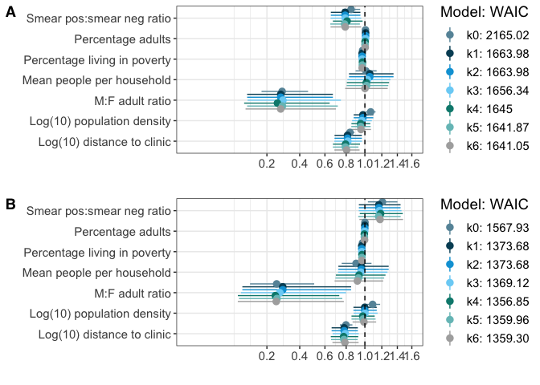<!-- -->

```r
ggsave(file="S3_fig.pdf", width=10, height=12, dpi=300, 
       path = here("figures"))
```


All TB cases final model

Select model with lowest WAIC (i.e. k6)


```r
#Overall model summary
summary(all_6)
```

```
##  Family: poisson 
##   Links: mu = log 
## Formula: n_cases ~ mean_people_per_hh + log_popdens + log_clinic_distance + mwi11povcons200 + m_f_adult_ratio + prop_adults + smr_ratio + offset(log(total)) 
##    Data: dat (Number of observations: 315) 
## Samples: 3 chains, each with iter = 4000; warmup = 1000; thin = 1;
##          total post-warmup samples = 9000
## 
## Correlation Structures:
##       Estimate Est.Error l-95% CI u-95% CI Eff.Sample Rhat
## car       0.96      0.04     0.86     1.00        743 1.00
## sdcar     1.12      0.08     0.97     1.29       2685 1.00
## 
## Population-Level Effects: 
##                     Estimate Est.Error l-95% CI u-95% CI Eff.Sample Rhat
## Intercept              -1.38      1.62    -4.61     1.84       2099 1.00
## mean_people_per_hh      0.00      0.12    -0.24     0.24       3155 1.00
## log_popdens            -0.04      0.06    -0.16     0.07       1695 1.00
## log_clinic_distance    -0.22      0.08    -0.38    -0.06        888 1.00
## mwi11povcons200        -0.03      0.01    -0.04    -0.02        841 1.00
## m_f_adult_ratio        -1.29      0.48    -2.24    -0.36       2969 1.00
## prop_adults             0.00      0.01    -0.02     0.02       2822 1.00
## smr_ratio              -0.24      0.10    -0.43    -0.04       3562 1.00
## 
## Samples were drawn using sampling(NUTS). For each parameter, Eff.Sample 
## is a crude measure of effective sample size, and Rhat is the potential 
## scale reduction factor on split chains (at convergence, Rhat = 1).
```

```r
#Model diagnostics
plot(all_6, ask = FALSE)
```

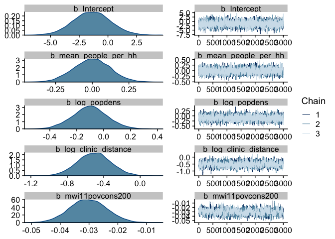<!-- -->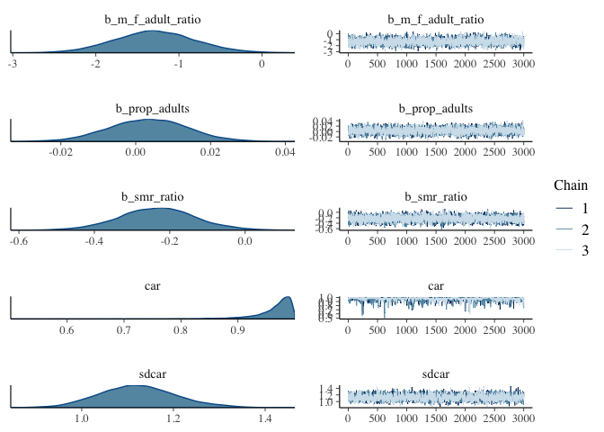<!-- -->

```r
pp_all_6 <- as_tibble(predict(all_6))
pp_all_6 <- dat %>%
  dplyr::select(c02hsaid, n_cases) %>%
  bind_cols(pp_all_6) %>%
  mutate(diff=n_cases - Estimate) %>%
  mutate(abdiff = abs(diff)) %>%
  arrange(diff) %>%
  mutate(c02hsaid = factor(c02hsaid))

residual1 <- pp_all_6 %>%
  ggplot() +
  geom_linerange(aes(x=fct_reorder(c02hsaid, n_cases, .desc=TRUE), ymin=n_cases, ymax=Estimate), alpha=0.7) +
  geom_point(aes(x=fct_reorder(c02hsaid, n_cases, .desc=TRUE), y=n_cases), colour="firebrick") +
  geom_point(aes(x=fct_reorder(c02hsaid, n_cases, .desc=TRUE), alpha=abdiff, y=Estimate), colour="steelblue") +
  theme_classic() +
  labs(x="",
       y="Observed (red) and predicted (blue) TB cases") +
  theme(axis.ticks.x = element_blank(),
        axis.text.x = element_blank()) +
  theme(legend.position="none")

ggsave(file="residual1.pdf", width=12, height=6, dpi=300, 
       path = here("figures"))


##Model estimates
ests_all_6<- tidy(exp(fixef(all_6)))

ests_all_6 %>%
  kable()
```


.rownames               Estimate   Est.Error        Q2.5       Q97.5
--------------------  ----------  ----------  ----------  ----------
Intercept              0.2521232    5.069099   0.0099294   6.3136670
mean_people_per_hh     1.0011103    1.131552   0.7898336   1.2742666
log_popdens            0.9563197    1.059092   0.8530981   1.0697869
log_clinic_distance    0.8043266    1.083867   0.6856071   0.9412028
mwi11povcons200        0.9698112    1.006420   0.9576369   0.9820074
m_f_adult_ratio        0.2757014    1.613966   0.1066825   0.7001181
prop_adults            1.0035378    1.010519   0.9833278   1.0245698
smr_ratio              0.7903526    1.104572   0.6501130   0.9587411


Select model with lowest WAIC for microbiologically-confirmed TB (i.e. k4).


```r
#Overall model summary
summary(micro_4)
```

```
##  Family: poisson 
##   Links: mu = log 
## Formula: n_micro_cases ~ mean_people_per_hh + log_popdens + log_clinic_distance + mwi11povcons200 + m_f_adult_ratio + prop_adults + smr_ratio + offset(log(total)) 
##    Data: dat (Number of observations: 315) 
## Samples: 3 chains, each with iter = 4000; warmup = 1000; thin = 1;
##          total post-warmup samples = 9000
## 
## Correlation Structures:
##       Estimate Est.Error l-95% CI u-95% CI Eff.Sample Rhat
## car       0.93      0.06     0.76     1.00        425 1.00
## sdcar     0.84      0.09     0.68     1.03        742 1.00
## 
## Population-Level Effects: 
##                     Estimate Est.Error l-95% CI u-95% CI Eff.Sample Rhat
## Intercept              -1.18      1.90    -4.89     2.53       1756 1.00
## mean_people_per_hh     -0.07      0.15    -0.36     0.22       2867 1.00
## log_popdens            -0.02      0.07    -0.16     0.11       1572 1.00
## log_clinic_distance    -0.26      0.09    -0.43    -0.08       1115 1.00
## mwi11povcons200        -0.03      0.01    -0.05    -0.02        617 1.00
## m_f_adult_ratio        -1.41      0.57    -2.52    -0.31       2850 1.00
## prop_adults            -0.01      0.01    -0.03     0.02       2334 1.00
## smr_ratio               0.17      0.11    -0.06     0.39       4151 1.00
## 
## Samples were drawn using sampling(NUTS). For each parameter, Eff.Sample 
## is a crude measure of effective sample size, and Rhat is the potential 
## scale reduction factor on split chains (at convergence, Rhat = 1).
```

```r
#Model diagnostics
plot(micro_4, ask = FALSE)
```

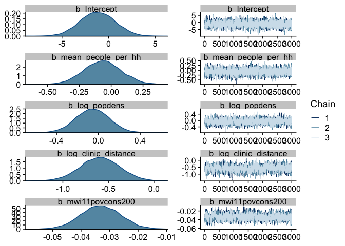<!-- --><!-- -->

```r
pp_micro_4 <- as_tibble(predict(micro_4))
pp_micro_4 <- dat %>%
  dplyr::select(c02hsaid, n_micro_cases) %>%
  bind_cols(pp_micro_4) %>%
  mutate(diff=n_micro_cases - Estimate) %>%
  mutate(abdiff = abs(diff)) %>%
  arrange(diff) %>%
  mutate(c02hsaid = factor(c02hsaid))

residual2 <- pp_micro_4 %>%
  ggplot() +
  geom_point(aes(x=fct_reorder(c02hsaid, n_micro_cases, .desc=TRUE), y=n_micro_cases), colour="firebrick") +
  geom_point(aes(x=fct_reorder(c02hsaid, n_micro_cases, .desc=TRUE), alpha=abdiff, y=Estimate), colour="steelblue") +
  geom_linerange(aes(x=fct_reorder(c02hsaid, n_micro_cases, .desc=TRUE), ymin=n_micro_cases, ymax=Estimate), alpha=0.7) +
  theme_classic() +
  labs(x="",
       y="Observed (red) and predicted (blue) TB cases") +
  theme(axis.ticks.x = element_blank(),
        axis.text.x = element_blank()) +
  theme(legend.position="none")

ggsave(file="residual2.pdf", width=12, height=6, dpi=300, 
       path = here("figures"))


##Model estimates
ests_micro_4<- tidy(exp(fixef(micro_4)))

ests_micro_4 %>%
  kable()
```


.rownames               Estimate   Est.Error        Q2.5        Q97.5
--------------------  ----------  ----------  ----------  -----------
Intercept              0.3081879    6.657227   0.0075207   12.5071202
mean_people_per_hh     0.9349778    1.158295   0.6992908    1.2462537
log_popdens            0.9763315    1.069820   0.8545207    1.1138316
log_clinic_distance    0.7745315    1.092997   0.6523305    0.9264324
mwi11povcons200        0.9674737    1.007287   0.9543333    0.9820310
m_f_adult_ratio        0.2448795    1.760290   0.0803541    0.7318556
prop_adults            0.9938711    1.011855   0.9711921    1.0171109
smr_ratio              1.1851797    1.118845   0.9430543    1.4734832

<br>

## 17. Figure 3: Marginal Effects plot


```r
me <- marginal_effects(all_6, 
                       conditions = data.frame(total = seq(1000,15000, 250)))
me2 <- marginal_effects(micro_4, conditions = data.frame(total = seq(1000,15000, 250)))

p1 <- me[[1]]
p1 <- p1 %>%
  mutate(rate=(estimate__/total)*100000) %>%
  mutate(l95 = (lower__/total)*100000) %>%
  mutate(u95 = (upper__/total)*100000) %>%
  dplyr::select(rate, l95,u95, value=mean_people_per_hh) %>% 
  mutate(type="All TB") %>%
  mutate(param = "Mean people per household") 

p2 <- me[[2]]
p2 <- p2 %>%
  mutate(rate=(estimate__/total)*100000) %>%
  mutate(l95 = (lower__/total)*100000) %>%
  mutate(u95 = (upper__/total)*100000) %>%
  dplyr::select(rate, l95,u95, value=log_popdens) %>% 
  mutate(type="All TB") %>%
  mutate(param = "Log population density")

p3 <- me[[3]]
p3 <- p3 %>%
  mutate(rate=(estimate__/total)*100000) %>%
  mutate(l95 = (lower__/total)*100000) %>%
  mutate(u95 = (upper__/total)*100000) %>%
  dplyr::select(rate, l95,u95, value=log_clinic_distance) %>% 
  mutate(type="All TB") %>%
  mutate(param = "Log clinic distance")

p4 <- me[[4]]
p4 <- p4 %>%
  mutate(rate=(estimate__/total)*100000) %>%
  mutate(l95 = (lower__/total)*100000) %>%
  mutate(u95 = (upper__/total)*100000) %>%
  dplyr::select(rate, l95,u95, value=mwi11povcons200) %>% 
  mutate(type="All TB") %>%
  mutate(param = "Percentage living in poverty")

p5 <- me[[5]]
p5 <- p5 %>%
  mutate(rate=(estimate__/total)*100000) %>%
  mutate(l95 = (lower__/total)*100000) %>%
  mutate(u95 = (upper__/total)*100000) %>%
  dplyr::select(rate, l95,u95, value=m_f_adult_ratio) %>% 
  mutate(type="All TB") %>%
  mutate(param = "M:F adult ratio")

p6 <- me[[6]]
p6 <- p6 %>%
  mutate(rate=(estimate__/total)*100000) %>%
  mutate(l95 = (lower__/total)*100000) %>%
  mutate(u95 = (upper__/total)*100000) %>%
  dplyr::select(rate, l95,u95, value=prop_adults) %>% 
  mutate(type="All TB") %>%
  mutate(param = "Percentage adults")

p7 <- me[[7]]
p7 <- p7 %>%
  mutate(rate=(estimate__/total)*100000) %>%
  mutate(l95 = (lower__/total)*100000) %>%
  mutate(u95 = (upper__/total)*100000) %>%
  dplyr::select(rate, l95,u95, value=smr_ratio) %>% 
  mutate(type="All TB") %>%
  mutate(param = "Smear positive:negative ratio")

p8 <- me2[[1]]
p8 <- p8 %>%
  mutate(rate=(estimate__/total)*100000) %>%
  mutate(l95 = (lower__/total)*100000) %>%
  mutate(u95 = (upper__/total)*100000) %>%
  dplyr::select(rate, l95,u95, value=mean_people_per_hh) %>% 
  mutate(type="Microbiologically-confirmed TB") %>%
  mutate(param = "Mean people per household")

p9 <- me2[[2]]
p9 <- p9 %>%
  mutate(rate=(estimate__/total)*100000) %>%
  mutate(l95 = (lower__/total)*100000) %>%
  mutate(u95 = (upper__/total)*100000) %>%
  dplyr::select(rate, l95,u95, value=log_popdens) %>% 
  mutate(type="Microbiologically-confirmed TB") %>%
  mutate(param = "Log population density")

p10 <- me2[[3]]
p10 <- p10 %>%
  mutate(rate=(estimate__/total)*100000) %>%
  mutate(l95 = (lower__/total)*100000) %>%
  mutate(u95 = (upper__/total)*100000) %>%
  dplyr::select(rate, l95,u95, value=log_clinic_distance) %>% 
  mutate(type="Microbiologically-confirmed TB") %>%
  mutate(param = "Log clinic distance")

p11 <- me2[[4]]
p11 <- p11 %>%
  mutate(rate=(estimate__/total)*100000) %>%
  mutate(l95 = (lower__/total)*100000) %>%
  mutate(u95 = (upper__/total)*100000) %>%
  dplyr::select(rate, l95,u95, value=mwi11povcons200) %>% 
  mutate(type="Microbiologically-confirmed TB") %>%
  mutate(param = "Percentage living in poverty")

p12 <- me2[[5]]
p12 <- p12 %>%
  mutate(rate=(estimate__/total)*100000) %>%
  mutate(l95 = (lower__/total)*100000) %>%
  mutate(u95 = (upper__/total)*100000) %>%
  dplyr::select(rate, l95,u95, value=m_f_adult_ratio) %>%
  mutate(type="Microbiologically-confirmed TB") %>%
  mutate(param = "M:F adult ratio")

p13 <- me2[[6]]
p13 <- p13 %>%
  mutate(rate=(estimate__/total)*100000) %>%
  mutate(l95 = (lower__/total)*100000) %>%
  mutate(u95 = (upper__/total)*100000) %>%
  dplyr::select(rate, l95,u95, value=prop_adults) %>%
  mutate(type="Microbiologically-confirmed TB") %>%
  mutate(param = "Percentage adults")

p14 <- me2[[7]]
p14 <- p14 %>%
  mutate(rate=(estimate__/total)*100000) %>%
  mutate(l95 = (lower__/total)*100000) %>%
  mutate(u95 = (upper__/total)*100000) %>%
  dplyr::select(rate, l95,u95, value=smr_ratio) %>%
  mutate(type="Microbiologically-confirmed TB") %>%
  mutate(param = "Smear positive:negative ratio")

pz <- bind_rows(p1, p2, p3, p4, p5, p6, p7,
                p8, p9, p10, p11, p12, p13, p14)


ggplot(pz) +
  geom_line(aes(x=value, y=rate, group=type, colour=type)) +
  geom_ribbon(aes(x=value, ymin=l95, ymax=u95, group=type, fill=type), alpha=0.3) +
  facet_wrap(~param, scales = "free") +
  ylim(0,1200) +
  ylab("TB case notification rate per 100,000 (95% credible interval)") +
  xlab("") +
  theme_minimal() +
  theme(legend.position="none")
```

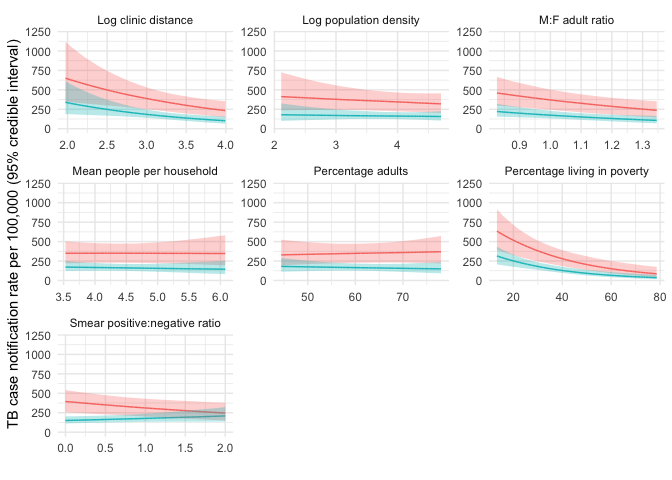<!-- -->

```r
ggsave(file="Figure3.pdf", width=8, height=8, dpi=300, 
       path = here("figures"))
```


<br>

##18. Supplemental Figure 3: Predicted and observed TB case notifications


```r
plot_grid(residual1, residual2,
          labels = c("A", "B"), ncol = 1,
          label_fontfamily = "Helvetica")
```

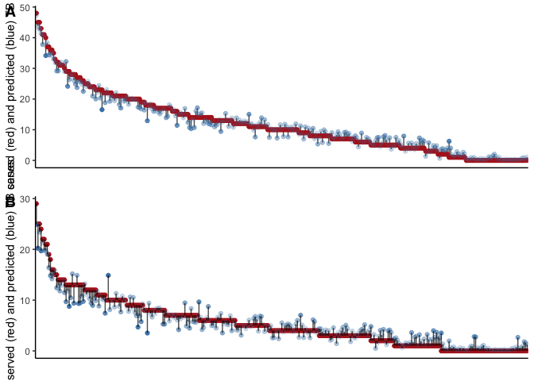<!-- -->

```r
ggsave(file="S3_Fig.pdf", width=8, height=8, dpi=300, 
       path = here("figures"))
```


